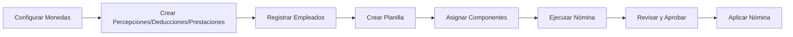

# Coati Payroll

[](https://www.python.org/downloads/)
[](https://opensource.org/licenses/Apache-2.0)

Sistema de administración de nóminas y planillas desarrollado por BMO Soluciones, S.A.

## 📋 Descripción

Coati Payroll es una aplicación web diseñada para facilitar la gestión completa del proceso de nómina de una empresa. El sistema permite configurar y ejecutar nóminas con percepciones, deducciones, prestaciones patronales y préstamos a empleados.

### Características Principales

- **Multi-empresa**: Gestione nóminas para múltiples empresas o entidades desde un solo sistema
- **Gestión de Empleados**: Registro completo de información personal, laboral y salarial
- **Campos Personalizados**: Extienda la información de empleados con campos personalizados
- **Percepciones Configurables**: Bonos, comisiones, horas extras y otros ingresos
- **Deducciones con Prioridad**: INSS, IR, préstamos y otras deducciones en orden configurable
- **Prestaciones Patronales**: INSS patronal, INATEC, vacaciones, aguinaldo, indemnización
- **Reglas de Cálculo**: Motor de reglas con esquemas configurables para cálculos complejos (IR, INSS, etc.)
- **Préstamos y Adelantos**: Control de préstamos con deducción automática de cuotas
- **Multi-moneda**: Soporte para múltiples monedas con tipos de cambio
- **Motor de Cálculo**: Procesamiento automático de nóminas con fórmulas configurables
- **Procesamiento en Segundo Plano**: Sistema de colas para nóminas grandes con Dramatiq/Huey

## 🚀 Instalación Rápida

### Requisitos

- Python 3.11 o superior
- pip (gestor de paquetes de Python)

### Pasos

1. **Clonar el repositorio**

```bash
git clone https://github.com/williamjmorenor/coati.git
cd coati
```

2. **Crear y activar entorno virtual**

```bash
python -m venv venv
source venv/bin/activate  # Linux/macOS
# o
venv\Scripts\activate     # Windows
```

3. **Instalar dependencias**

```bash
pip install -r requirements.txt
```

4. **Ejecutar la aplicación**

```bash
python app.py
```

5. **Acceder al sistema**

Abra su navegador en `http://localhost:5000`

**Credenciales por defecto:**
- Usuario: `coati-admin`
- Contraseña: `coati-admin`

> ⚠️ **Importante**: Cambie las credenciales por defecto en entornos de producción.

## 📖 Documentación

La documentación completa está disponible en el directorio `docs/` y puede ser generada con MkDocs:

```bash
# Instalar dependencias de documentación
pip install -r docs.txt

# Servir documentación localmente
mkdocs serve

# Generar documentación estática
mkdocs build
```

### Contenido de la Documentación

- **[Guía de Inicio Rápido](docs/guia/inicio-rapido.md)**: 15 minutos desde instalación hasta su primera nómina - ideal para evaluar el sistema
- **Guía de Instalación**: Requisitos, instalación y configuración inicial
- **Guía de Uso**: Usuarios, empresas, monedas, empleados, campos personalizados, conceptos de nómina, reglas de cálculo
- **Tutorial Completo**: Paso a paso para configurar y ejecutar una nómina con todos los componentes
- **Características Avanzadas**: Sistema de colas, procesamiento en segundo plano, compatibilidad de bases de datos
- **Referencia**: Glosario y preguntas frecuentes

## 🏗️ Arquitectura

```
coati/
├── app.py                 # Punto de entrada de la aplicación
├── coati_payroll/         # Módulo principal
│   ├── __init__.py        # Factory de la aplicación Flask
│   ├── model.py           # Modelos de base de datos (SQLAlchemy)
│   ├── nomina_engine.py   # Motor de cálculo de nómina
│   ├── formula_engine.py  # Motor de fórmulas
│   ├── forms.py           # Formularios WTForms
│   ├── queue/             # Sistema de colas (Dramatiq/Huey)
│   ├── vistas/            # Vistas/Controladores (Blueprints)
│   ├── templates/         # Plantillas HTML (Jinja2)
│   └── static/            # Archivos estáticos
├── docs/                  # Documentación MkDocs
├── requirements.txt       # Dependencias de producción
├── development.txt        # Dependencias de desarrollo
└── docs.txt               # Dependencias de documentación
```

## 🔧 Configuración

### Variables de Entorno

| Variable | Descripción | Valor por Defecto |
|----------|-------------|-------------------|
| `DATABASE_URL` | URI de conexión a la base de datos | SQLite local |
| `SECRET_KEY` | Clave secreta para sesiones | Auto-generada |
| `ADMIN_USER` | Usuario administrador inicial | `coati-admin` |
| `ADMIN_PASSWORD` | Contraseña del administrador | `coati-admin` |
| `PORT` | Puerto de la aplicación | `5000` |
| `SESSION_REDIS_URL` | URL de Redis para sesiones | Ninguno (usa SQLAlchemy) |
| `REDIS_URL` | URL de Redis para sistema de colas | Ninguno (usa Huey) |
| `QUEUE_ENABLED` | Habilitar sistema de colas | `1` |
| `COATI_QUEUE_PATH` | Ruta para almacenamiento de Huey | Auto-detectada |
| `BACKGROUND_PAYROLL_THRESHOLD` | Umbral de empleados para procesamiento en segundo plano | `100` |

### Base de Datos

El sistema soporta:
- **SQLite**: Para desarrollo y pruebas (por defecto)
- **PostgreSQL**: Recomendado para producción
- **MySQL/MariaDB**: Alternativa para producción

El sistema está diseñado para ser **agnóstico al motor de base de datos**. Para más detalles sobre compatibilidad y configuración, consulte la [Guía de Compatibilidad de Base de Datos](docs/database-compatibility.md).

### Sistema de Colas

Para operaciones de larga duración, el sistema incluye un **sistema de colas de procesos en segundo plano**:

- **Dramatiq + Redis**: Para entornos de producción con alta escala
- **Huey + Filesystem**: Para desarrollo o como fallback automático
- **Selección automática**: El sistema elige el mejor backend disponible
- **Procesamiento paralelo**: Nóminas grandes se procesan automáticamente en segundo plano
- **Feedback en tiempo real**: Seguimiento del progreso de las tareas

Para más información, consulte la [Documentación del Sistema de Colas](docs/queue_system.md) y [Procesamiento de Nómina en Segundo Plano](docs/background-payroll-processing.md).

## 📊 Flujo de Trabajo



## 🧮 Cálculo de Nómina

El motor de nómina procesa en este orden:

1. **Percepciones**: Se suman al salario base → Salario Bruto
2. **Deducciones**: Se restan en orden de prioridad → Salario Neto
3. **Prestaciones**: Se calculan como costos patronales (no afectan salario neto)

### Ejemplo de Cálculo

```
Salario Base:           C$ 20,000.00
+ Bono Productividad:   C$  1,500.00
= SALARIO BRUTO:        C$ 21,500.00

- INSS Laboral (7%):    C$  1,505.00
- IR:                   C$    950.00
- Cuota Préstamo:       C$  2,000.00
= SALARIO NETO:         C$ 17,045.00

Prestaciones Patronales:
+ INSS Patronal (22.5%): C$ 4,837.50
+ INATEC (2%):           C$   430.00
+ Vacaciones (8.33%):    C$ 1,790.95
+ Aguinaldo (8.33%):     C$ 1,790.95
+ Indemnización (8.33%): C$ 1,790.95
= COSTO TOTAL EMPRESA:   C$ 32,140.35
```

## 🛠️ Desarrollo

### Instalar dependencias de desarrollo

```bash
pip install -r development.txt
```

### Estructura de la Base de Datos

Los principales modelos son:

- `Usuario`: Usuarios del sistema
- `Empresa`: Empresas o entidades que contratan empleados
- `Empleado`: Registro maestro de empleados
- `CampoPersonalizado`: Campos personalizados para empleados
- `Percepcion`: Conceptos de ingreso
- `Deduccion`: Conceptos de descuento
- `Prestacion`: Aportes patronales
- `ReglaCalculo`: Reglas de cálculo con esquemas configurables
- `Planilla`: Configuración de nómina
- `Nomina`: Ejecución de nómina
- `Adelanto`: Préstamos y adelantos

## 📄 Licencia

Este proyecto está licenciado bajo la [Licencia Apache 2.0](LICENSE).

## 👥 Contribuir

Las contribuciones son bienvenidas. Por favor:

1. Fork el repositorio
2. Cree una rama para su feature (`git checkout -b feature/nueva-funcionalidad`)
3. Commit sus cambios (`git commit -am 'Agregar nueva funcionalidad'`)
4. Push a la rama (`git push origin feature/nueva-funcionalidad`)
5. Abra un Pull Request

## 📞 Soporte

Para reportar problemas o solicitar funcionalidades, por favor abra un [Issue en GitHub](https://github.com/williamjmorenor/coati/issues).

---

Desarrollado con ❤️ por [BMO Soluciones, S.A.](https://github.com/williamjmorenor)