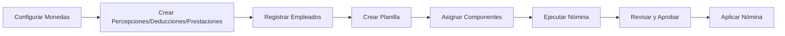

# Coati Payroll

[](https://github.com/bmosoluciones/coati-payroll/actions/workflows/python-package.yml)
[](https://codecov.io/github/bmosoluciones/coati-payroll)
[](https://www.python.org/downloads/)
[](https://opensource.org/licenses/Apache-2.0)
[](https://github.com/psf/black)
[](https://github.com/prettier/prettier)
[](https://github.com/astral-sh/ruff)

Motor de cálculo de planillas agnóstico a la jurisdicción desarrollado por BMO Soluciones, S.A.

## Descripción

Coati Payroll es un **motor de cálculo de nóminas flexible y extensible**, completamente agnóstico a la jurisdicción. El sistema está diseñado para que organizaciones e implementadores puedan definir sus propias reglas de nómina mediante configuración, sin necesidad de modificar el código fuente.

El motor no incorpora reglas legales hardcodeadas. Todas las percepciones, deducciones, prestaciones, impuestos y otros conceptos de nómina existen únicamente si el implementador los configura.

> **Importante**: Este proyecto se rige por un [Contrato Social](SOCIAL_CONTRACT.md) que define claramente su alcance, propósito y limitaciones. Por favor, léalo antes de usar el sistema en producción.

### Características Principales

- **Agnóstico a la Jurisdicción**: No incorpora reglas legales hardcodeadas; toda la lógica de nómina se define por configuración
- **Motor de Cálculo Configurable**: Procesamiento de nóminas con fórmulas y esquemas completamente configurables
- **Reglas de Cálculo Flexibles**: Sistema de reglas que permite implementar cualquier lógica de nómina mediante configuración
- **Multi-empresa**: Gestione nóminas para múltiples empresas o entidades desde un solo sistema
- **Gestión de Empleados**: Registro completo de información personal, laboral y salarial
- **Campos Personalizados**: Extienda la información de empleados con campos personalizados
- **Percepciones Configurables**: Defina cualquier tipo de ingreso adicional (bonos, comisiones, horas extras, etc.)
- **Deducciones con Prioridad**: Configure deducciones en orden de prioridad según sus necesidades
- **Prestaciones Patronales**: Configure prestaciones y aportes patronales según requerimientos
- **Préstamos y Adelantos**: Control de préstamos con deducción automática de cuotas
- **Multi-moneda**: Soporte para múltiples monedas con tipos de cambio
- **Procesamiento en Segundo Plano**: Sistema de colas para nóminas grandes con Dramatiq/Huey
- **Gestión de Vacaciones**: Módulo completo de acumulación, uso y auditoría de vacaciones con políticas configurables
- **Control de Acceso Basado en Roles (RBAC)**: Sistema de permisos con roles Admin, HHRR y Audit
- **Sistema de Reportes**: Reportes personalizados con permisos por rol y auditoría de ejecuciones
- **Internacionalización**: Soporte multi-idioma con traducción de interfaz y contenidos

## Instalación Rápida

### Requisitos

- Python 3.11 o superior
- pip (gestor de paquetes de Python)

### Pasos

1. **Clonar el repositorio**

```bash
git clone https://github.com/bmosoluciones/coati-payroll.git
cd coati
```

2. **Crear y activar entorno virtual**

```bash
python -m venv venv
source venv/bin/activate  # Linux/macOS
# o
venv\Scripts\activate     # Windows
```

3. **Instalar dependencias**

```bash
pip install -r requirements.txt
```

4. **Ejecutar la aplicación**

```bash
python app.py
```

5. **Acceder al sistema**

Abra su navegador en `http://localhost:5000`

**Credenciales por defecto:**
- Usuario: `coati-admin`
- Contraseña: `coati-admin`

> **Importante**: Cambie las credenciales por defecto en entornos de producción.

## Documentación

La documentación completa está disponible en el directorio `docs/` y puede ser generada con MkDocs:

```bash
# Instalar dependencias de documentación
pip install -r docs.txt

# Servir documentación localmente
mkdocs serve

# Generar documentación estática
mkdocs build
```

### Contenido de la Documentación

- **[Guía de Inicio Rápido](docs/guia/inicio-rapido.md)**: 15 minutos desde instalación hasta su primera nómina - ideal para evaluar el sistema
- **Guía de Instalación**: Requisitos, instalación y configuración inicial
- **Guía de Uso**: Usuarios, empresas, monedas, empleados, campos personalizados, conceptos de nómina, reglas de cálculo, préstamos, vacaciones, configuración contable
- **Tutorial Completo**: Paso a paso para configurar y ejecutar una nómina con todos los componentes
- **Características Avanzadas**: 
  - Sistema de colas y procesamiento en segundo plano
  - Compatibilidad de bases de datos (SQLite, PostgreSQL, MySQL/MariaDB)
  - Control de acceso basado en roles (RBAC)
  - Gestión de vacaciones con políticas configurables
  - Sistema de reportes personalizados
  - Internacionalización y traducción
- **Referencia**: Glosario, preguntas frecuentes, importación de tipos de cambio

## Arquitectura

```
coati/
├── app.py                 # Punto de entrada de la aplicación
├── coati_payroll/         # Módulo principal
│   ├── __init__.py        # Factory de la aplicación Flask
│   ├── model.py           # Modelos de base de datos (SQLAlchemy)
│   ├── nomina_engine/     # Motor de cálculo de nómina (refactorizado)
│   │   ├── __init__.py
│   │   ├── engine.py      # Orquestador principal
│   │   ├── domain/        # Modelos de dominio
│   │   │   ├── payroll_context.py
│   │   │   ├── employee_calculation.py
│   │   │   └── calculation_items.py
│   │   ├── validators/    # Validaciones
│   │   │   ├── base_validator.py
│   │   │   ├── planilla_validator.py
│   │   │   ├── employee_validator.py
│   │   │   ├── period_validator.py
│   │   │   └── currency_validator.py
│   │   ├── calculators/   # Cálculos
│   │   │   ├── salary_calculator.py
│   │   │   ├── concept_calculator.py
│   │   │   ├── perception_calculator.py
│   │   │   ├── deduction_calculator.py
│   │   │   ├── benefit_calculator.py
│   │   │   └── exchange_rate_calculator.py
│   │   ├── processors/    # Procesadores específicos
│   │   │   ├── loan_processor.py
│   │   │   ├── accumulation_processor.py
│   │   │   ├── vacation_processor.py
│   │   │   ├── novelty_processor.py
│   │   │   └── accounting_processor.py
│   │   ├── repositories/  # Acceso a datos
│   │   │   ├── base_repository.py
│   │   │   ├── planilla_repository.py
│   │   │   ├── employee_repository.py
│   │   │   ├── acumulado_repository.py
│   │   │   ├── novelty_repository.py
│   │   │   ├── exchange_rate_repository.py
│   │   │   └── config_repository.py
│   │   ├── services/      # Servicios de negocio
│   │   │   ├── payroll_execution_service.py
│   │   │   └── employee_processing_service.py
│   │   └── results/       # Resultados y DTOs
│   │       ├── payroll_result.py
│   │       ├── validation_result.py
│   │       └── error_result.py
│   ├── formula_engine/    # Motor de fórmulas (refactorizado)
│   │   ├── __init__.py
│   │   ├── engine.py      # Orquestador principal
│   │   ├── exceptions.py  # Excepciones personalizadas
│   │   ├── data_sources.py # Fuentes de datos disponibles
│   │   ├── novelty_codes.py # Códigos de novedades
│   │   ├── ast/           # Evaluación de expresiones (Visitor pattern)
│   │   │   ├── ast_visitor.py
│   │   │   ├── expression_evaluator.py
│   │   │   ├── safe_operators.py
│   │   │   └── type_converter.py
│   │   ├── validation/    # Validaciones
│   │   │   ├── schema_validator.py
│   │   │   ├── tax_table_validator.py
│   │   │   └── security_validator.py
│   │   ├── steps/         # Tipos de paso (Strategy pattern)
│   │   │   ├── base_step.py
│   │   │   ├── calculation_step.py
│   │   │   ├── conditional_step.py
│   │   │   ├── tax_lookup_step.py
│   │   │   ├── assignment_step.py
│   │   │   └── step_factory.py
│   │   ├── tables/        # Tablas de impuestos
│   │   │   ├── tax_table.py
│   │   │   ├── bracket_calculator.py
│   │   │   └── table_lookup.py
│   │   ├── execution/     # Contexto de ejecución
│   │   │   ├── execution_context.py
│   │   │   ├── step_executor.py
│   │   │   └── variable_store.py
│   │   └── results/       # Resultados
│   │       └── execution_result.py
│   ├── formula_engine_examples.py # Ejemplos de esquemas
│   ├── vacation_service.py # Servicio de gestión de vacaciones
│   ├── rbac.py            # Control de acceso basado en roles
│   ├── report_engine.py   # Motor de reportes
│   ├── forms.py           # Formularios WTForms
│   ├── cli.py             # Interfaz de línea de comandos (payrollctl)
│   ├── queue/             # Sistema de colas (Dramatiq/Huey)
│   │   ├── driver.py
│   │   ├── selector.py
│   │   ├── tasks.py
│   │   └── drivers/
│   ├── vistas/            # Vistas/Controladores (Blueprints)
│   │   ├── planilla/      # Módulo de planillas
│   │   └── [otros módulos]
│   ├── templates/         # Plantillas HTML (Jinja2)
│   ├── translations/      # Archivos de traducción (i18n)
│   └── static/            # Archivos estáticos
├── docs/                  # Documentación MkDocs
├── requirements.txt       # Dependencias de producción
├── development.txt        # Dependencias de desarrollo
└── docs.txt               # Dependencias de documentación
```

## Configuración

### Interfaz de Línea de Comandos (CLI)

El sistema incluye la herramienta `payrollctl` para tareas administrativas comunes. También puede usar `flask` para comandos integrados.

**Operaciones del Sistema:**

```bash
# Ver estado del sistema
payrollctl system status

# Ejecutar verificaciones del sistema
payrollctl system check

# Ver información del sistema
payrollctl system info

# Ver variables de entorno
payrollctl system env
```

**Gestión de Base de Datos:**

```bash
# Ver estado de la base de datos
payrollctl database status

# Inicializar base de datos y crear usuario administrador
payrollctl database init

# Cargar datos iniciales (monedas, conceptos, etc.)
payrollctl database seed

# Crear respaldo de la base de datos usando herramientas nativas
# SQLite: Copia el archivo | PostgreSQL: pg_dump | MySQL: mysqldump
payrollctl database backup -o backup_$(date +%Y%m%d).sql

# Restaurar base de datos desde respaldo
payrollctl database restore backup.db

# Migración de base de datos (requiere flask-migrate)
payrollctl database migrate
payrollctl database upgrade

# Eliminar todas las tablas (¡CUIDADO!)
payrollctl database drop
```

**Gestión de Usuarios:**

```bash
# Listar todos los usuarios
payrollctl users list

# Crear un nuevo usuario
payrollctl users create

# Deshabilitar un usuario
payrollctl users disable username

# Restablecer contraseña
payrollctl users reset-password username

# Crear o actualizar usuario administrador (desactiva otros admins)
payrollctl users set-admin
```

**Gestión de Caché:**

```bash
# Limpiar cachés de la aplicación
payrollctl cache clear

# Precalentar cachés
payrollctl cache warm

# Ver estado del caché
payrollctl cache status
```

**Tareas de Mantenimiento:**

```bash
# Limpiar sesiones expiradas
payrollctl maintenance cleanup-sessions

# Limpiar archivos temporales
payrollctl maintenance cleanup-temp

# Ejecutar trabajos pendientes en segundo plano
payrollctl maintenance run-jobs
```

**Diagnóstico y Depuración:**

```bash
# Ver configuración de la aplicación
payrollctl debug config

# Listar todas las rutas de la aplicación
payrollctl debug routes
```

**Nota**: Todos los comandos también funcionan con `flask` (ej: `flask system status`).

**Respaldos Automatizados**: Para configurar respaldos diarios automáticos con systemd timers, consulte [Automated Backups Guide](docs/automated-backups.md).

### Variables de Entorno

| Variable | Descripción | Valor por Defecto |
|----------|-------------|-------------------|
| `DATABASE_URL` | URI de conexión a la base de datos | SQLite local |
| `SECRET_KEY` | Clave secreta para sesiones | Auto-generada |
| `ADMIN_USER` | Usuario administrador inicial | `coati-admin` |
| `ADMIN_PASSWORD` | Contraseña del administrador | `coati-admin` |
| `PORT` | Puerto de la aplicación | `5000` |
| `SESSION_REDIS_URL` | URL de Redis para sesiones | Ninguno (usa SQLAlchemy) |
| `REDIS_URL` | URL de Redis para sistema de colas | Ninguno (usa Huey) |
| `QUEUE_ENABLED` | Habilitar sistema de colas | `1` |
| `COATI_QUEUE_PATH` | Ruta para almacenamiento de Huey | Auto-detectada |
| `BACKGROUND_PAYROLL_THRESHOLD` | Umbral de empleados para procesamiento en segundo plano | `100` |

### Base de Datos

El sistema soporta:
- **SQLite**: Para desarrollo y pruebas (por defecto)
- **PostgreSQL**: Recomendado para producción
- **MySQL/MariaDB**: Alternativa para producción

El sistema está diseñado para ser **agnóstico al motor de base de datos**. Para más detalles sobre compatibilidad y configuración, consulte la [Guía de Compatibilidad de Base de Datos](docs/database-compatibility.md).

### Sistema de Colas

Para operaciones de larga duración, el sistema incluye un **sistema de colas de procesos en segundo plano**:

- **Dramatiq + Redis**: Para entornos de producción con alta escala
- **Huey + Filesystem**: Para desarrollo o como fallback automático
- **Selección automática**: El sistema elige el mejor backend disponible
- **Procesamiento paralelo**: Nóminas grandes se procesan automáticamente en segundo plano
- **Feedback en tiempo real**: Seguimiento del progreso de las tareas

Para más información, consulte la [Documentación del Sistema de Colas](docs/queue_system.md) y [Procesamiento de Nómina en Segundo Plano](docs/background-payroll-processing.md).

## Flujo de Trabajo



## Cálculo de Nómina

El motor de nómina procesa en este orden:

1. **Salario Base**: Salario definido para el empleado según el período de planilla
2. **Percepciones**: Se suman al salario base → Salario Bruto
3. **Deducciones**: Se restan en orden de prioridad → Salario Neto
4. **Prestaciones**: Se calculan como costos patronales (no afectan salario neto)

### Ejemplo Ilustrativo de Cálculo

> **Nota Importante**: Este es un ejemplo ilustrativo con valores y conceptos genéricos. Los nombres de conceptos, porcentajes y cálculos específicos **deben ser configurados por el implementador** según las leyes y políticas de su jurisdicción. El motor **no incluye reglas legales predefinidas**.

```
Salario Base:              $ 10,000.00
+ Percepción A:            $    500.00
+ Percepción B:            $    300.00
= SALARIO BRUTO:           $ 10,800.00

- Deducción A (X%):        $    756.00
- Deducción B (Y%):        $    540.00
- Deducción C:             $    200.00
= SALARIO NETO:            $  9,304.00

Prestaciones Patronales (Costos Empresa):
+ Prestación A (W%):       $  2,160.00
+ Prestación B (Z%):       $    216.00
+ Prestación C (P%):       $    899.64
+ Prestación D (P%):       $    899.64
+ Prestación E (P%):       $    899.64
= COSTO TOTAL EMPRESA:     $ 15,178.92
```

**¿Cómo configurar estos conceptos?**

Todos los conceptos, porcentajes y reglas de cálculo se definen mediante:
- **Percepciones configurables**: Defina cualquier tipo de ingreso adicional
- **Deducciones con prioridad**: Configure el orden y fórmula de cada deducción
- **Prestaciones patronales**: Configure los aportes según su jurisdicción
- **Reglas de cálculo**: Use el motor de reglas para implementar lógicas complejas (tramos, topes, exenciones, etc.)

Consulte la [documentación completa](docs/) para aprender a configurar su sistema de nómina.

## Desarrollo

### Instalar dependencias de desarrollo

```bash
pip install -r development.txt
```

### Estructura de la Base de Datos

Los principales modelos son:

**Configuración del Sistema:**
- `Usuario`: Usuarios del sistema con roles (Admin, HHRR, Audit)
- `Empresa`: Empresas o entidades que contratan empleados
- `Moneda`: Monedas del sistema
- `TipoCambio`: Tipos de cambio entre monedas
- `ConfiguracionGlobal`: Configuración global del sistema

**Gestión de Personal:**
- `Empleado`: Registro maestro de empleados
- `CampoPersonalizado`: Campos personalizados para empleados
- `HistorialSalario`: Historial de cambios salariales

**Nómina:**
- `Percepcion`: Conceptos de ingreso
- `Deduccion`: Conceptos de descuento
- `Prestacion`: Aportes patronales
- `ReglaCalculo`: Reglas de cálculo con esquemas configurables
- `TipoPlanilla`: Tipos de planilla (mensual, quincenal, etc.)
- `Planilla`: Configuración de nómina
- `Nomina`: Ejecución de nómina
- `NominaEmpleado`: Detalle de nómina por empleado
- `NominaDetalle`: Líneas de detalle (percepciones, deducciones)
- `NominaNovedad`: Novedades de nómina
- `ComprobanteContable`: Comprobantes contables

**Préstamos:**
- `Adelanto`: Préstamos y adelantos a empleados
- `AdelantoAbono`: Abonos a préstamos

**Vacaciones:**
- `VacationPolicy`: Políticas de vacaciones configurables
- `VacationAccount`: Cuentas de vacaciones por empleado
- `VacationLedger`: Libro mayor de vacaciones (auditoría)
- `VacationNovelty`: Solicitudes y novedades de vacaciones
- `ConfiguracionVacaciones`: Configuración de vacaciones (legacy)
- `VacacionEmpleado`: Vacaciones por empleado (legacy)
- `PrestacionAcumulada`: Prestaciones acumuladas
- `CargaInicialPrestacion`: Carga inicial de prestaciones

**Reportes:**
- `Report`: Definición de reportes personalizados
- `ReportRole`: Permisos de reportes por rol
- `ReportExecution`: Historial de ejecuciones de reportes
- `ReportAudit`: Auditoría de reportes

## Contrato Social y Responsabilidades

Este proyecto se rige por un [Contrato Social](SOCIAL_CONTRACT.md) que establece claramente:

### Alcance del Proyecto

- **Motor agnóstico a la jurisdicción**: No incluye ni incluirá reglas legales hardcodeadas
- **Separación estricta**: Entre motor de cálculo, configuración de reglas y orquestación de nómina
- **Cálculo predecible y reproducible**: Los cálculos son determinísticos y auditables
- **Extensible por configuración**: Cualquier cambio legal se implementa mediante configuración, no código

### Funcionalidad por Defecto

El motor, por defecto, **solo** calcula:
1. Salario base del empleado según el período definido
2. Cuotas de anticipos salariales cuando existen

Todos los demás conceptos (percepciones, deducciones, prestaciones, impuestos, topes, tramos, exenciones) existen únicamente si el implementador los configura.

### Responsabilidad del Implementador

El uso correcto del motor requiere que el implementador:
- Tenga conocimiento de cómo se calcula una nómina en su jurisdicción
- Comprenda el marco legal aplicable
- Sea capaz de calcular manualmente una nómina completa
- Compare resultados manuales con los del sistema
- Identifique y corrija errores de configuración

### Garantías y Limitaciones

Este software se distribuye bajo la Licencia Apache 2.0 **"tal como está" (AS IS)**:
- ✅ **Promete**: Cálculos predecibles, reproducibles y auditables
- ✅ **Promete**: Mantenerse agnóstico a la jurisdicción
- ✅ **Promete**: Separación entre motor y configuración
- ❌ **No garantiza**: Cumplimiento normativo de ninguna jurisdicción
- ❌ **No garantiza**: Resultados correctos sin configuración apropiada
- ❌ **No sustituye**: Conocimiento profesional ni asesoría legal

**Para más detalles, lea el [Contrato Social](SOCIAL_CONTRACT.md) completo antes de usar este sistema en producción.**

## Licencia

Este proyecto está licenciado bajo la [Licencia Apache 2.0](LICENSE).

## Contribuir

Las contribuciones son bienvenidas. Por favor:

1. Fork el repositorio
2. Cree una rama para su feature (`git checkout -b feature/nueva-funcionalidad`)
3. Commit sus cambios (`git commit -am 'Agregar nueva funcionalidad'`)
4. Push a la rama (`git push origin feature/nueva-funcionalidad`)
5. Abra un Pull Request

## Soporte

Para reportar problemas o solicitar funcionalidades, por favor abra un [Issue en GitHub](https://github.com/williamjmorenor/coati/issues).

---

Desarrollado con ❤️ por [BMO Soluciones, S.A.](https://github.com/williamjmorenor)
