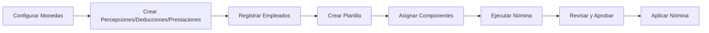

# Coati Payroll

[](https://github.com/bmosoluciones/coati-payroll/actions/workflows/python-package.yml)
[](https://codecov.io/github/bmosoluciones/coati-payroll)
[](https://www.python.org/downloads/)
[](https://opensource.org/licenses/Apache-2.0)

Sistema de administración de nóminas y planillas desarrollado por BMO Soluciones, S.A.

## Descripción

Coati Payroll es una aplicación web diseñada para facilitar la gestión completa del proceso de nómina de una empresa. El sistema permite configurar y ejecutar nóminas con percepciones, deducciones, prestaciones patronales y préstamos a empleados.

### Características Principales

- **Multi-empresa**: Gestione nóminas para múltiples empresas o entidades desde un solo sistema
- **Gestión de Empleados**: Registro completo de información personal, laboral y salarial
- **Campos Personalizados**: Extienda la información de empleados con campos personalizados
- **Percepciones Configurables**: Bonos, comisiones, horas extras y otros ingresos
- **Deducciones con Prioridad**: INSS, IR, préstamos y otras deducciones en orden configurable
- **Prestaciones Patronales**: INSS patronal, INATEC, vacaciones, aguinaldo, indemnización
- **Reglas de Cálculo**: Motor de reglas con esquemas configurables para cálculos complejos (IR, INSS, etc.)
- **Préstamos y Adelantos**: Control de préstamos con deducción automática de cuotas
- **Multi-moneda**: Soporte para múltiples monedas con tipos de cambio
- **Motor de Cálculo**: Procesamiento automático de nóminas con fórmulas configurables
- **Procesamiento en Segundo Plano**: Sistema de colas para nóminas grandes con Dramatiq/Huey
- **Gestión de Vacaciones**: Módulo completo de acumulación, uso y auditoría de vacaciones con políticas configurables
- **Control de Acceso Basado en Roles (RBAC)**: Sistema de permisos con roles Admin, HHRR y Audit
- **Sistema de Reportes**: Reportes personalizados con permisos por rol y auditoría de ejecuciones
- **Internacionalización**: Soporte multi-idioma con traducción de interfaz y contenidos

## Instalación Rápida

### Requisitos

- Python 3.11 o superior
- pip (gestor de paquetes de Python)

### Pasos

1. **Clonar el repositorio**

```bash
git clone https://github.com/bmosoluciones/coati-payroll.git
cd coati
```

2. **Crear y activar entorno virtual**

```bash
python -m venv venv
source venv/bin/activate  # Linux/macOS
# o
venv\Scripts\activate     # Windows
```

3. **Instalar dependencias**

```bash
pip install -r requirements.txt
```

4. **Ejecutar la aplicación**

```bash
python app.py
```

5. **Acceder al sistema**

Abra su navegador en `http://localhost:5000`

**Credenciales por defecto:**
- Usuario: `coati-admin`
- Contraseña: `coati-admin`

> **Importante**: Cambie las credenciales por defecto en entornos de producción.

## Documentación

La documentación completa está disponible en el directorio `docs/` y puede ser generada con MkDocs:

```bash
# Instalar dependencias de documentación
pip install -r docs.txt

# Servir documentación localmente
mkdocs serve

# Generar documentación estática
mkdocs build
```

### Contenido de la Documentación

- **[Guía de Inicio Rápido](docs/guia/inicio-rapido.md)**: 15 minutos desde instalación hasta su primera nómina - ideal para evaluar el sistema
- **Guía de Instalación**: Requisitos, instalación y configuración inicial
- **Guía de Uso**: Usuarios, empresas, monedas, empleados, campos personalizados, conceptos de nómina, reglas de cálculo, préstamos, vacaciones, configuración contable
- **Tutorial Completo**: Paso a paso para configurar y ejecutar una nómina con todos los componentes
- **Características Avanzadas**: 
  - Sistema de colas y procesamiento en segundo plano
  - Compatibilidad de bases de datos (SQLite, PostgreSQL, MySQL/MariaDB)
  - Control de acceso basado en roles (RBAC)
  - Gestión de vacaciones con políticas configurables
  - Sistema de reportes personalizados
  - Internacionalización y traducción
- **Referencia**: Glosario, preguntas frecuentes, importación de tipos de cambio

## Arquitectura

```
coati/
├── app.py                 # Punto de entrada de la aplicación
├── coati_payroll/         # Módulo principal
│   ├── __init__.py        # Factory de la aplicación Flask
│   ├── model.py           # Modelos de base de datos (SQLAlchemy)
│   ├── nomina_engine/     # Motor de cálculo de nómina (refactorizado)
│   │   ├── __init__.py
│   │   ├── engine.py      # Orquestador principal
│   │   ├── domain/        # Modelos de dominio
│   │   │   ├── payroll_context.py
│   │   │   ├── employee_calculation.py
│   │   │   └── calculation_items.py
│   │   ├── validators/    # Validaciones
│   │   │   ├── base_validator.py
│   │   │   ├── planilla_validator.py
│   │   │   ├── employee_validator.py
│   │   │   ├── period_validator.py
│   │   │   └── currency_validator.py
│   │   ├── calculators/   # Cálculos
│   │   │   ├── salary_calculator.py
│   │   │   ├── concept_calculator.py
│   │   │   ├── perception_calculator.py
│   │   │   ├── deduction_calculator.py
│   │   │   ├── benefit_calculator.py
│   │   │   └── exchange_rate_calculator.py
│   │   ├── processors/    # Procesadores específicos
│   │   │   ├── loan_processor.py
│   │   │   ├── accumulation_processor.py
│   │   │   ├── vacation_processor.py
│   │   │   ├── novelty_processor.py
│   │   │   └── accounting_processor.py
│   │   ├── repositories/  # Acceso a datos
│   │   │   ├── base_repository.py
│   │   │   ├── planilla_repository.py
│   │   │   ├── employee_repository.py
│   │   │   ├── acumulado_repository.py
│   │   │   ├── novelty_repository.py
│   │   │   ├── exchange_rate_repository.py
│   │   │   └── config_repository.py
│   │   ├── services/      # Servicios de negocio
│   │   │   ├── payroll_execution_service.py
│   │   │   └── employee_processing_service.py
│   │   └── results/       # Resultados y DTOs
│   │       ├── payroll_result.py
│   │       ├── validation_result.py
│   │       └── error_result.py
│   ├── formula_engine/    # Motor de fórmulas (refactorizado)
│   │   ├── __init__.py
│   │   ├── engine.py      # Orquestador principal
│   │   ├── exceptions.py  # Excepciones personalizadas
│   │   ├── data_sources.py # Fuentes de datos disponibles
│   │   ├── novelty_codes.py # Códigos de novedades
│   │   ├── ast/           # Evaluación de expresiones (Visitor pattern)
│   │   │   ├── ast_visitor.py
│   │   │   ├── expression_evaluator.py
│   │   │   ├── safe_operators.py
│   │   │   └── type_converter.py
│   │   ├── validation/    # Validaciones
│   │   │   ├── schema_validator.py
│   │   │   ├── tax_table_validator.py
│   │   │   └── security_validator.py
│   │   ├── steps/         # Tipos de paso (Strategy pattern)
│   │   │   ├── base_step.py
│   │   │   ├── calculation_step.py
│   │   │   ├── conditional_step.py
│   │   │   ├── tax_lookup_step.py
│   │   │   ├── assignment_step.py
│   │   │   └── step_factory.py
│   │   ├── tables/        # Tablas de impuestos
│   │   │   ├── tax_table.py
│   │   │   ├── bracket_calculator.py
│   │   │   └── table_lookup.py
│   │   ├── execution/     # Contexto de ejecución
│   │   │   ├── execution_context.py
│   │   │   ├── step_executor.py
│   │   │   └── variable_store.py
│   │   └── results/       # Resultados
│   │       └── execution_result.py
│   ├── formula_engine_examples.py # Ejemplos de esquemas
│   ├── vacation_service.py # Servicio de gestión de vacaciones
│   ├── rbac.py            # Control de acceso basado en roles
│   ├── report_engine.py   # Motor de reportes
│   ├── forms.py           # Formularios WTForms
│   ├── cli.py             # Interfaz de línea de comandos (payrollctl)
│   ├── queue/             # Sistema de colas (Dramatiq/Huey)
│   │   ├── driver.py
│   │   ├── selector.py
│   │   ├── tasks.py
│   │   └── drivers/
│   ├── vistas/            # Vistas/Controladores (Blueprints)
│   │   ├── planilla/      # Módulo de planillas
│   │   └── [otros módulos]
│   ├── templates/         # Plantillas HTML (Jinja2)
│   ├── translations/      # Archivos de traducción (i18n)
│   └── static/            # Archivos estáticos
├── docs/                  # Documentación MkDocs
├── requirements.txt       # Dependencias de producción
├── development.txt        # Dependencias de desarrollo
└── docs.txt               # Dependencias de documentación
```

## Configuración

### Interfaz de Línea de Comandos (CLI)

El sistema incluye la herramienta `payrollctl` para tareas administrativas comunes. También puede usar `flask` para comandos integrados.

**Operaciones del Sistema:**

```bash
# Ver estado del sistema
payrollctl system status

# Ejecutar verificaciones del sistema
payrollctl system check

# Ver información del sistema
payrollctl system info

# Ver variables de entorno
payrollctl system env
```

**Gestión de Base de Datos:**

```bash
# Ver estado de la base de datos
payrollctl database status

# Inicializar base de datos y crear usuario administrador
payrollctl database init

# Cargar datos iniciales (monedas, conceptos, etc.)
payrollctl database seed

# Crear respaldo de la base de datos usando herramientas nativas
# SQLite: Copia el archivo | PostgreSQL: pg_dump | MySQL: mysqldump
payrollctl database backup -o backup_$(date +%Y%m%d).sql

# Restaurar base de datos desde respaldo
payrollctl database restore backup.db

# Migración de base de datos (requiere flask-migrate)
payrollctl database migrate
payrollctl database upgrade

# Eliminar todas las tablas (¡CUIDADO!)
payrollctl database drop
```

**Gestión de Usuarios:**

```bash
# Listar todos los usuarios
payrollctl users list

# Crear un nuevo usuario
payrollctl users create

# Deshabilitar un usuario
payrollctl users disable username

# Restablecer contraseña
payrollctl users reset-password username

# Crear o actualizar usuario administrador (desactiva otros admins)
payrollctl users set-admin
```

**Gestión de Caché:**

```bash
# Limpiar cachés de la aplicación
payrollctl cache clear

# Precalentar cachés
payrollctl cache warm

# Ver estado del caché
payrollctl cache status
```

**Tareas de Mantenimiento:**

```bash
# Limpiar sesiones expiradas
payrollctl maintenance cleanup-sessions

# Limpiar archivos temporales
payrollctl maintenance cleanup-temp

# Ejecutar trabajos pendientes en segundo plano
payrollctl maintenance run-jobs
```

**Diagnóstico y Depuración:**

```bash
# Ver configuración de la aplicación
payrollctl debug config

# Listar todas las rutas de la aplicación
payrollctl debug routes
```

**Nota**: Todos los comandos también funcionan con `flask` (ej: `flask system status`).

**Respaldos Automatizados**: Para configurar respaldos diarios automáticos con systemd timers, consulte [Automated Backups Guide](docs/automated-backups.md).

### Variables de Entorno

| Variable | Descripción | Valor por Defecto |
|----------|-------------|-------------------|
| `DATABASE_URL` | URI de conexión a la base de datos | SQLite local |
| `SECRET_KEY` | Clave secreta para sesiones | Auto-generada |
| `ADMIN_USER` | Usuario administrador inicial | `coati-admin` |
| `ADMIN_PASSWORD` | Contraseña del administrador | `coati-admin` |
| `PORT` | Puerto de la aplicación | `5000` |
| `SESSION_REDIS_URL` | URL de Redis para sesiones | Ninguno (usa SQLAlchemy) |
| `REDIS_URL` | URL de Redis para sistema de colas | Ninguno (usa Huey) |
| `QUEUE_ENABLED` | Habilitar sistema de colas | `1` |
| `COATI_QUEUE_PATH` | Ruta para almacenamiento de Huey | Auto-detectada |
| `BACKGROUND_PAYROLL_THRESHOLD` | Umbral de empleados para procesamiento en segundo plano | `100` |

### Base de Datos

El sistema soporta:
- **SQLite**: Para desarrollo y pruebas (por defecto)
- **PostgreSQL**: Recomendado para producción
- **MySQL/MariaDB**: Alternativa para producción

El sistema está diseñado para ser **agnóstico al motor de base de datos**. Para más detalles sobre compatibilidad y configuración, consulte la [Guía de Compatibilidad de Base de Datos](docs/database-compatibility.md).

### Sistema de Colas

Para operaciones de larga duración, el sistema incluye un **sistema de colas de procesos en segundo plano**:

- **Dramatiq + Redis**: Para entornos de producción con alta escala
- **Huey + Filesystem**: Para desarrollo o como fallback automático
- **Selección automática**: El sistema elige el mejor backend disponible
- **Procesamiento paralelo**: Nóminas grandes se procesan automáticamente en segundo plano
- **Feedback en tiempo real**: Seguimiento del progreso de las tareas

Para más información, consulte la [Documentación del Sistema de Colas](docs/queue_system.md) y [Procesamiento de Nómina en Segundo Plano](docs/background-payroll-processing.md).

## Flujo de Trabajo



## Cálculo de Nómina

El motor de nómina procesa en este orden:

1. **Percepciones**: Se suman al salario base → Salario Bruto
2. **Deducciones**: Se restan en orden de prioridad → Salario Neto
3. **Prestaciones**: Se calculan como costos patronales (no afectan salario neto)

### Ejemplo de Cálculo

```
Salario Base:           C$ 20,000.00
+ Bono Productividad:   C$  1,500.00
= SALARIO BRUTO:        C$ 21,500.00

- INSS Laboral (7%):    C$  1,505.00
- IR:                   C$    950.00
- Cuota Préstamo:       C$  2,000.00
= SALARIO NETO:         C$ 17,045.00

Prestaciones Patronales:
+ INSS Patronal (22.5%): C$ 4,837.50
+ INATEC (2%):           C$   430.00
+ Vacaciones (8.33%):    C$ 1,790.95
+ Aguinaldo (8.33%):     C$ 1,790.95
+ Indemnización (8.33%): C$ 1,790.95
= COSTO TOTAL EMPRESA:   C$ 32,140.35
```

## Desarrollo

### Instalar dependencias de desarrollo

```bash
pip install -r development.txt
```

### Estructura de la Base de Datos

Los principales modelos son:

**Configuración del Sistema:**
- `Usuario`: Usuarios del sistema con roles (Admin, HHRR, Audit)
- `Empresa`: Empresas o entidades que contratan empleados
- `Moneda`: Monedas del sistema
- `TipoCambio`: Tipos de cambio entre monedas
- `ConfiguracionGlobal`: Configuración global del sistema

**Gestión de Personal:**
- `Empleado`: Registro maestro de empleados
- `CampoPersonalizado`: Campos personalizados para empleados
- `HistorialSalario`: Historial de cambios salariales

**Nómina:**
- `Percepcion`: Conceptos de ingreso
- `Deduccion`: Conceptos de descuento
- `Prestacion`: Aportes patronales
- `ReglaCalculo`: Reglas de cálculo con esquemas configurables
- `TipoPlanilla`: Tipos de planilla (mensual, quincenal, etc.)
- `Planilla`: Configuración de nómina
- `Nomina`: Ejecución de nómina
- `NominaEmpleado`: Detalle de nómina por empleado
- `NominaDetalle`: Líneas de detalle (percepciones, deducciones)
- `NominaNovedad`: Novedades de nómina
- `ComprobanteContable`: Comprobantes contables

**Préstamos:**
- `Adelanto`: Préstamos y adelantos a empleados
- `AdelantoAbono`: Abonos a préstamos

**Vacaciones:**
- `VacationPolicy`: Políticas de vacaciones configurables
- `VacationAccount`: Cuentas de vacaciones por empleado
- `VacationLedger`: Libro mayor de vacaciones (auditoría)
- `VacationNovelty`: Solicitudes y novedades de vacaciones
- `ConfiguracionVacaciones`: Configuración de vacaciones (legacy)
- `VacacionEmpleado`: Vacaciones por empleado (legacy)
- `PrestacionAcumulada`: Prestaciones acumuladas
- `CargaInicialPrestacion`: Carga inicial de prestaciones

**Reportes:**
- `Report`: Definición de reportes personalizados
- `ReportRole`: Permisos de reportes por rol
- `ReportExecution`: Historial de ejecuciones de reportes
- `ReportAudit`: Auditoría de reportes

## Licencia

Este proyecto está licenciado bajo la [Licencia Apache 2.0](LICENSE).

## Contribuir

Las contribuciones son bienvenidas. Por favor:

1. Fork el repositorio
2. Cree una rama para su feature (`git checkout -b feature/nueva-funcionalidad`)
3. Commit sus cambios (`git commit -am 'Agregar nueva funcionalidad'`)
4. Push a la rama (`git push origin feature/nueva-funcionalidad`)
5. Abra un Pull Request

## Soporte

Para reportar problemas o solicitar funcionalidades, por favor abra un [Issue en GitHub](https://github.com/williamjmorenor/coati/issues).

---

Desarrollado con ❤️ por [BMO Soluciones, S.A.](https://github.com/williamjmorenor)
