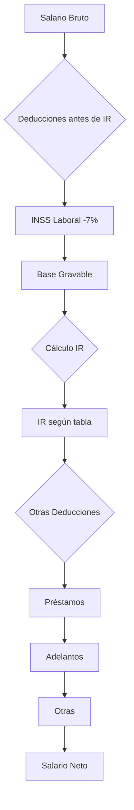

# Deducciones

Las deducciones son conceptos que se **restan** del salario bruto del empleado para obtener el salario neto.

## Concepto

```
Salario Bruto - Deducciones = Salario Neto
```

Las deducciones incluyen:

- Seguro social (INSS laboral)
- Impuesto sobre la renta (IR)
- Cuotas de préstamos
- Adelantos salariales
- Pensiones alimenticias
- Cuotas sindicales
- Ahorros voluntarios

## Acceder al Módulo

1. Navegue a **Configuración > Deducciones**

## Crear Nueva Deducción

1. Haga clic en **Nueva Deducción**
2. Complete el formulario

### Datos Básicos

| Campo | Descripción | Requerido |
|-------|-------------|-----------|
| Código | Identificador único (ej: `INSS_LABORAL`) | Sí |
| Nombre | Nombre descriptivo | Sí |
| Descripción | Descripción detallada | No |
| Tipo de Deducción | Categoría de la deducción | Sí |
| Es Impuesto | Si es un impuesto (IR, ISR) | No |

### Tipos de Deducción

| Tipo | Descripción |
|------|-------------|
| **General** | Deducción general |
| **Impuesto** | Impuestos (IR, ISR) |
| **Seguro Social** | Aportes a seguridad social |
| **Préstamo** | Cuotas de préstamos |
| **Adelanto** | Adelantos salariales |
| **Pensión Alimenticia** | Pensiones ordenadas judicialmente |
| **Ahorro** | Ahorro voluntario |
| **Sindical** | Cuota sindical |
| **Otro** | Otras deducciones |

### Configuración de Cálculo

| Campo | Descripción |
|-------|-------------|
| Tipo de Cálculo | Cómo se calcula el monto |
| Monto Predeterminado | Valor fijo |
| Porcentaje | Porcentaje a aplicar |
| Base de Cálculo | Sobre qué se calcula |
| Antes de Impuesto | Si se deduce antes del IR |

#### Tipos de Cálculo

| Tipo | Descripción | Ejemplo |
|------|-------------|---------|
| **Monto Fijo** | Un valor fijo | Cuota sindical de C$ 100 |
| **Porcentaje del Salario Base** | % del salario base | N/A |
| **Porcentaje del Salario Bruto** | % del bruto | INSS 7% |
| **Porcentaje del Salario Gravable** | % del gravable | IR |
| **Tabla de Impuestos** | Usa tabla progresiva | IR Nicaragua |
| **Fórmula Personalizada** | Cálculo con fórmula JSON | Cálculos complejos |

### Configuración Adicional

| Campo | Descripción |
|-------|-------------|
| Antes de Impuesto | ¿Se deduce antes de calcular impuestos? |
| Recurrente | ¿Se aplica automáticamente? |
| Vigente Desde | Fecha de inicio de vigencia |
| Válido Hasta | Fecha de fin de vigencia |
| Editable en Nómina | ¿Se puede modificar? |

## Prioridad de Deducciones

!!! important "Concepto Clave"
    Las deducciones se aplican en **orden de prioridad**. Si el salario no alcanza para todas las deducciones, se aplican primero las de mayor prioridad (número menor).

### Guía de Prioridades

| Rango | Tipo de Deducción | Ejemplo |
|-------|-------------------|---------|
| 1-100 | Legal/Obligatorias | INSS, IR, pensión alimenticia |
| 101-200 | Ordenadas judicialmente | Embargos |
| 201-300 | Préstamos y adelantos | Cuotas de préstamos |
| 301-400 | Voluntarias | Ahorro, sindicato |
| 401+ | Otras | Otras deducciones |

### Configurar Prioridad

La prioridad se configura al asignar la deducción a la planilla:

1. Edite la planilla
2. Al agregar una deducción, configure la prioridad
3. Menor número = mayor prioridad (se aplica primero)

## Ejemplos de Deducciones

### INSS Laboral (Nicaragua)

```yaml
Código: INSS_LABORAL
Nombre: INSS Laboral
Tipo de Deducción: Seguro Social
Tipo de Cálculo: Porcentaje del Salario Bruto
Porcentaje: 7.00
Antes de Impuesto: Sí
Es Impuesto: No
```

### Impuesto sobre la Renta (IR)

```yaml
Código: IR
Nombre: Impuesto sobre la Renta
Tipo de Deducción: Impuesto
Tipo de Cálculo: Tabla de Impuestos (o Fórmula)
Antes de Impuesto: No
Es Impuesto: Sí
```

!!! note "Cálculo del IR"
    El IR en Nicaragua se calcula sobre la expectativa salarial anual usando una tabla progresiva. Consulte la sección de [Configuración de Planillas](planillas.md) para más detalles sobre reglas de cálculo.

### Cuota Sindical

```yaml
Código: SINDICATO
Nombre: Cuota Sindical
Tipo de Deducción: Sindical
Tipo de Cálculo: Porcentaje del Salario Base
Porcentaje: 2.00
Antes de Impuesto: No
```

### Pensión Alimenticia

```yaml
Código: PENSION_ALIM
Nombre: Pensión Alimenticia
Tipo de Deducción: Pensión Alimenticia
Tipo de Cálculo: Porcentaje del Salario Neto
Porcentaje: 25.00  # O el % ordenado por el juez
Antes de Impuesto: No
```

### Ahorro Voluntario

```yaml
Código: AHORRO
Nombre: Ahorro Voluntario
Tipo de Deducción: Ahorro
Tipo de Cálculo: Monto Fijo
Monto Predeterminado: 500.00
Antes de Impuesto: No
```

## Deducciones Antes de Impuesto

El campo **Antes de Impuesto** determina si la deducción reduce la base imponible para el cálculo del IR.

### Se deducen ANTES del IR:

- INSS laboral (7%)
- Aportes a AFP/fondos de pensión
- Algunos seguros médicos

### Se deducen DESPUÉS del IR:

- Préstamos
- Adelantos
- Ahorros voluntarios
- Cuotas sindicales

## Asignar a Planilla

1. Navegue a **Planillas** y edite la planilla
2. En la sección **Deducciones**, haga clic en **Agregar Deducción**
3. Configure:
   - Seleccione la deducción
   - Configure la **prioridad**
   - Marque si es **obligatoria**
4. Haga clic en **Agregar**

### Deducción Obligatoria

Si marca una deducción como obligatoria:

- Se aplicará incluso si el salario neto queda en negativo
- Útil para deducciones legales que no pueden omitirse

## Deducciones Automáticas

Los préstamos y adelantos se deducen automáticamente si:

- Están registrados en el módulo de Adelantos
- El estado es "aprobado"
- Tienen saldo pendiente

Consulte la guía de [Préstamos y Adelantos](prestamos.md) para más información.

## Tablas de Impuesto

Para impuestos progresivos como el IR, puede configurar tablas de tramos:

| Desde | Hasta | % | Cuota Fija | Sobre Excedente |
|-------|-------|---|------------|-----------------|
| 0 | 100,000 | 0% | 0 | 0 |
| 100,001 | 200,000 | 15% | 0 | 100,000 |
| 200,001 | 350,000 | 20% | 15,000 | 200,000 |
| 350,001 | 500,000 | 25% | 45,000 | 350,000 |
| 500,001+ | - | 30% | 82,500 | 500,000 |

## Flujo de Cálculo



## Buenas Prácticas

### Prioridades

- Configure prioridades correctamente
- Las deducciones legales deben tener prioridad alta
- Documente el orden de prioridades

### Auditoría

- Cada nómina registra las deducciones aplicadas
- Puede consultar qué deducciones no se aplicaron por saldo insuficiente

### Actualización

- Actualice porcentajes cuando cambie la ley
- Use fechas de vigencia para cambios programados

## Solución de Problemas

### "La deducción no se aplicó"

- Verifique que esté activa
- Verifique que esté asignada a la planilla
- Si no es obligatoria, puede haberse omitido por saldo insuficiente (verifique advertencias)

### "El monto de IR es incorrecto"

- Verifique las deducciones antes de impuesto
- Verifique la tabla de impuestos configurada
- Verifique los valores acumulados del empleado
