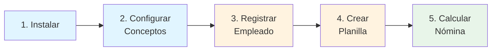
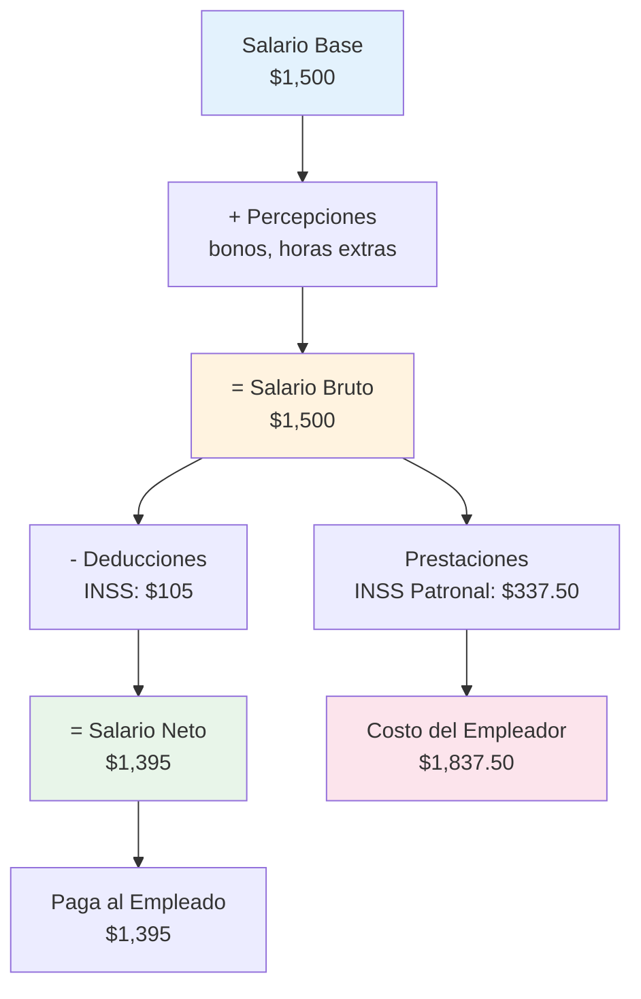
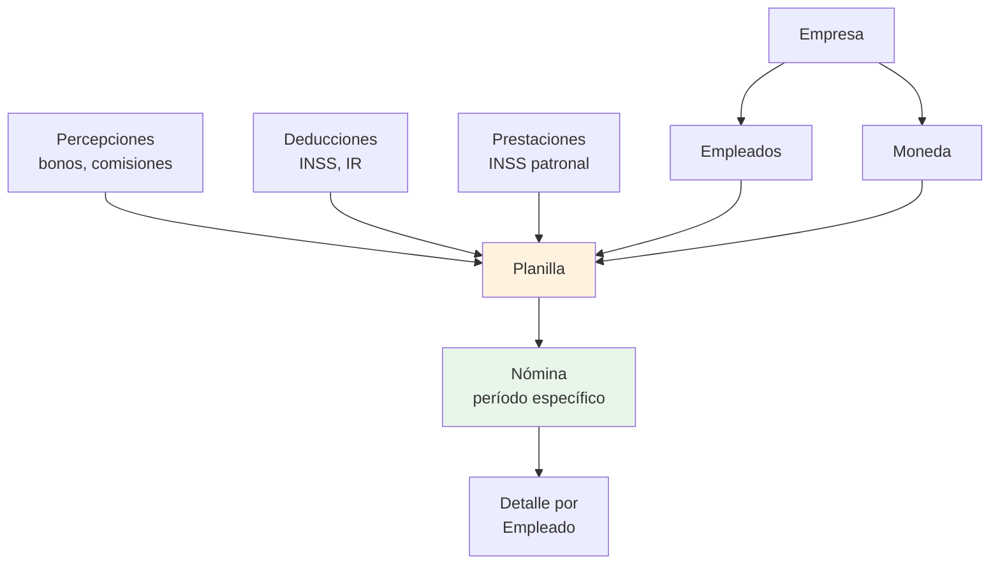

# Guía de Inicio Rápido

¡Bienvenido a Coati Payroll! Esta guía le ayudará a evaluar rápidamente el sistema siguiendo un flujo de trabajo completo: desde la instalación hasta calcular su primera nómina.

## ¿Qué aprenderá?

En **15-20 minutos**, podrá:

- ✅ Instalar y ejecutar Coati Payroll
- ✅ Configurar conceptos básicos de nómina
- ✅ Registrar un empleado
- ✅ Crear una planilla (payroll)
- ✅ Calcular su primera nómina

## Resumen del Flujo de Trabajo



---

## Paso 1: Instalación (5 minutos)

### Requisitos Previos

- Python 3.11 o superior
- pip (gestor de paquetes de Python)

### Instalar y Ejecutar

```bash
# 1. Clonar el repositorio
git clone https://github.com/williamjmorenor/coati.git
cd coati

# 2. Crear entorno virtual
python -m venv venv

# 3. Activar entorno virtual
source venv/bin/activate  # Linux/macOS
# o
venv\Scripts\activate     # Windows

# 4. Instalar dependencias
pip install -r requirements.txt

# 5. Ejecutar la aplicación
python app.py
```

### Acceder al Sistema

1. Abra su navegador en: **http://localhost:5000**
2. Inicie sesión con:
   - **Usuario**: `coati-admin`
   - **Contraseña**: `coati-admin`

!!! success "¡Sistema Listo!"
    Si puede ver el panel principal, el sistema está funcionando correctamente.

---

## Paso 2: Configurar Conceptos Básicos (5 minutos)

Antes de calcular nómina, necesita definir los conceptos que se aplicarán.

### 2.1 Crear Moneda

**Navegue a**: Configuración → Monedas → **Nueva Moneda**

| Campo | Ejemplo |
|-------|---------|
| Código | `USD` |
| Nombre | `Dólar Estadounidense` |
| Símbolo | `$` |
| Activo | ✓ |

**Guardar**

### 2.2 Crear una Deducción (INSS)

**Navegue a**: Configuración → Deducciones → **Nueva Deducción**

| Campo | Ejemplo |
|-------|---------|
| Código | `INSS` |
| Nombre | `Seguro Social` |
| Tipo de Cálculo | `Porcentaje del Salario Bruto` |
| Porcentaje | `7.00` |
| Recurrente | ✓ |
| Activo | ✓ |

**Guardar**

### 2.3 Crear una Prestación (INSS Patronal)

**Navegue a**: Configuración → Prestaciones → **Nueva Prestación**

| Campo | Ejemplo |
|-------|---------|
| Código | `INSS_PATRONAL` |
| Nombre | `INSS Patronal` |
| Tipo de Cálculo | `Porcentaje del Salario Bruto` |
| Porcentaje | `22.50` |
| Recurrente | ✓ |
| Activo | ✓ |

**Guardar**

!!! info "¿Qué son estos conceptos?"
    - **Deducciones**: Descuentos del salario del empleado (INSS, impuestos, etc.)
    - **Prestaciones**: Aportes del empleador que NO afectan el salario neto (INSS patronal, vacaciones, etc.)

---

## Paso 3: Registrar un Empleado (2 minutos)

**Navegue a**: Personal → Empleados → **Nuevo Empleado**

Complete la información básica:

### Datos Personales

| Campo | Ejemplo |
|-------|---------|
| Primer Nombre | `Ana` |
| Primer Apellido | `García` |
| Identificación | `001-010190-0001X` |

### Datos Laborales

| Campo | Ejemplo |
|-------|---------|
| Fecha de Alta | `01/01/2025` |
| Cargo | `Analista` |
| Activo | ✓ |

### Datos de Pago

| Campo | Ejemplo |
|-------|---------|
| Salario Base | `1500.00` |
| Moneda | `USD - Dólar Estadounidense` |

**Guardar**

---

## Paso 4: Crear una Planilla (3 minutos)

La planilla conecta empleados con los conceptos de nómina (deducciones, prestaciones).

**Navegue a**: Planillas → **Nueva Planilla**

### 4.1 Configuración Base

| Campo | Ejemplo |
|-------|---------|
| Nombre | `Planilla Mensual` |
| Descripción | `Nómina mensual` |
| Tipo de Planilla | `Mensual` |
| Moneda | `USD - Dólar Estadounidense` |
| Activo | ✓ |

**Guardar**

### 4.2 Asignar Empleado

En la pantalla de edición de la planilla:

1. Sección **Empleados** → **Agregar**
2. Seleccione: `Ana García`
3. **Guardar**

### 4.3 Asignar Deducciones

En la sección **Deducciones**:

1. **Agregar**
2. Seleccione: `INSS - Seguro Social`
3. **Prioridad**: `10`
4. **Obligatoria**: ✓
5. **Guardar**

### 4.4 Asignar Prestaciones

En la sección **Prestaciones**:

1. **Agregar**
2. Seleccione: `INSS Patronal`
3. **Orden**: `1`
4. **Guardar**

---

## Paso 5: Calcular su Primera Nómina (2 minutos)

### 5.1 Ejecutar Nómina

Desde la planilla:

1. Clic en **Ejecutar Nómina**
2. Configure el período:
   - **Período Inicio**: `01/01/2025`
   - **Período Fin**: `31/01/2025`
   - **Fecha de Cálculo**: `31/01/2025`
3. Clic en **Ejecutar**

### 5.2 Ver Resultados

El sistema calcula automáticamente:

```
=== Ana García ===

Salario Base:           $  1,500.00
-----------------------------------
SALARIO BRUTO:          $  1,500.00

Deducciones:
  - INSS (7%):          $    105.00
-----------------------------------
SALARIO NETO:           $  1,395.00

Prestaciones Patronales:
  - INSS Patronal (22.5%): $    337.50
-----------------------------------
COSTO TOTAL EMPLEADOR:  $  1,837.50
```

!!! success "¡Primera Nómina Calculada!"
    El sistema procesó automáticamente:
    
    - ✅ Cálculo del salario bruto
    - ✅ Aplicación de deducciones (INSS 7%)
    - ✅ Cálculo del salario neto
    - ✅ Cálculo de prestaciones patronales (INSS Patronal 22.5%)
    - ✅ Costo total para el empleador

---

## Entendiendo el Cálculo

### Flujo de Cálculo



### ¿Qué Significa Cada Monto?

| Concepto | Monto | ¿Quién lo Paga? | ¿Qué es? |
|----------|-------|-----------------|----------|
| **Salario Base** | $1,500.00 | Empleador → Empleado | Sueldo acordado |
| **Salario Bruto** | $1,500.00 | - | Base + percepciones |
| **INSS Laboral (7%)** | $105.00 | Empleado (deducción) | Seguro social del trabajador |
| **Salario Neto** | $1,395.00 | **Empleador → Empleado** | **Lo que recibe el empleado** |
| **INSS Patronal (22.5%)** | $337.50 | Empleador | Aporte patronal al seguro social |
| **Costo Total** | $1,837.50 | **Costo para Empleador** | **Salario bruto + prestaciones** |

---

## ¿Qué Sigue?

### Funcionalidades Adicionales que Puede Explorar

#### 1. Percepciones (Ingresos Adicionales)
Agregue bonos, comisiones, horas extras:

- **Navegue a**: Configuración → Percepciones
- **Ejemplos**: Bono de productividad, comisiones, viáticos

#### 2. Más Deducciones
Configure impuestos y otras deducciones:

- Impuesto sobre la renta (IR)
- Cuota sindical
- Anticipos y préstamos

#### 3. Más Prestaciones
Agregue provisiones patronales:

- Provisión de vacaciones
- Provisión de aguinaldo
- Provisión de indemnización
- INATEC

#### 4. Préstamos a Empleados
Gestione préstamos con deducción automática de cuotas:

- **Navegue a**: Personal → Adelantos/Préstamos

#### 5. Múltiples Empleados
Agregue más empleados a su planilla para calcular nóminas completas

#### 6. Campos Personalizados
Extienda la información de empleados con campos adicionales

---

## Entendiendo la Estructura

### Jerarquía del Sistema



### Conceptos Clave

!!! tip "Planilla"
    Es la **configuración maestra** que define:
    
    - ¿Qué empleados se pagan?
    - ¿Qué conceptos se aplican? (deducciones, percepciones, prestaciones)
    - ¿Con qué frecuencia? (mensual, quincenal, semanal)

!!! tip "Nómina"
    Es la **ejecución** de una planilla para un período específico:
    
    - Una planilla puede tener múltiples nóminas (enero, febrero, marzo...)
    - Cada nómina contiene el cálculo detallado por empleado

---

## Casos de Uso Comunes

### Escenario 1: Empleado con Horas Extras

1. Crear percepción "Horas Extras"
2. Al ejecutar nómina, agregar **Novedad**:
   - Empleado: Ana García
   - Concepto: Horas Extras
   - Horas: 10
3. Recalcular nómina

### Escenario 2: Empleado con Préstamo

1. Registrar préstamo en: Personal → Adelantos/Préstamos
2. Aprobar el préstamo con cuotas
3. Al ejecutar nómina, el sistema deduce automáticamente la cuota

### Escenario 3: Nómina Quincenal

1. Crear nueva planilla con tipo "Quincenal"
2. Ejecutar dos veces al mes con períodos de 15 días

---

## Recursos Adicionales

### Documentación Detallada

| Guía | Descripción |
|------|-------------|
| [Tutorial Completo](../tutorial/nomina-completa.md) | Ejemplo paso a paso con todos los componentes |
| [Primeros Pasos](primeros-pasos.md) | Conceptos fundamentales del sistema |
| [Gestión de Empleados](empleados.md) | Registro y administración de personal |
| [Percepciones](percepciones.md) | Configuración de ingresos adicionales |
| [Deducciones](deducciones.md) | Configuración de descuentos |
| [Prestaciones](prestaciones.md) | Aportes patronales |
| [Planillas](planillas.md) | Configuración avanzada de planillas |
| [Ejecución de Nómina](nomina.md) | Novedades, recálculo, aprobación |

### Características Avanzadas

- **[Sistema de Colas](../queue_system.md)**: Procesamiento en segundo plano para nóminas grandes
- **[Reglas de Cálculo](reglas-calculo.md)**: Configuración de impuestos progresivos (IR)
- **[Campos Personalizados](campos-personalizados.md)**: Información adicional de empleados
- **[Multi-moneda](monedas.md)**: Tipos de cambio y conversiones

---

## Preguntas Frecuentes

??? question "¿Puedo usar Coati Payroll para múltiples empresas?"
    Sí, el sistema soporta **multi-empresa**. Puede gestionar nóminas para diferentes entidades desde una sola instalación.

??? question "¿Qué bases de datos soporta?"
    - **SQLite**: Para desarrollo y pruebas (por defecto)
    - **PostgreSQL**: Recomendado para producción
    - **MySQL/MariaDB**: Alternativa para producción

??? question "¿Cómo manejo impuestos progresivos como el IR?"
    Configure **Reglas de Cálculo** con esquemas estructurados para tablas progresivas. Consulte la [Guía de Reglas de Cálculo](reglas-calculo.md).

??? question "¿Puedo personalizar la información de empleados?"
    Sí, mediante **Campos Personalizados**. Agregue cualquier información específica que necesite (tipo de sangre, contactos de emergencia, etc.).

??? question "¿El sistema maneja préstamos automáticamente?"
    Sí, una vez aprobado un préstamo, el sistema deduce automáticamente las cuotas en cada nómina según la configuración de la planilla.

??? question "¿Qué pasa si una nómina tiene muchos empleados?"
    Para nóminas grandes (>100 empleados por defecto), el sistema utiliza **procesamiento en segundo plano** con feedback en tiempo real.

---

## ¿Necesita Ayuda?

- **Documentación Completa**: Explore la [Guía de Uso](primeros-pasos.md) y el [Tutorial Completo](../tutorial/nomina-completa.md)
- **Soporte**: [Abrir un Issue en GitHub](https://github.com/williamjmorenor/coati/issues)
- **Repositorio**: [github.com/williamjmorenor/coati](https://github.com/williamjmorenor/coati)

---

!!! success "¡Listo para Empezar!"
    Ahora tiene una comprensión completa del flujo de trabajo de Coati Payroll. Puede evaluar si el sistema se ajusta a sus necesidades y comenzar a configurarlo para su organización.
