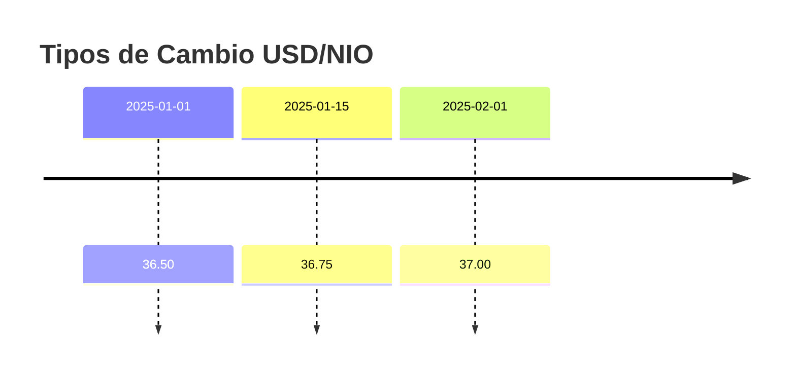

# Monedas y Tipos de Cambio

El sistema soporta múltiples monedas, permitiendo pagar salarios en diferentes divisas y manejar conversiones automáticas.

## Gestión de Monedas

### Acceder al Módulo

1. Navegue a **Configuración > Monedas**

### Crear Nueva Moneda

1. Haga clic en **Nueva Moneda**
2. Complete el formulario:

| Campo | Descripción | Ejemplo |
|-------|-------------|---------|
| Código | Código ISO de la moneda (3 caracteres) | `NIO` |
| Nombre | Nombre completo de la moneda | `Córdoba Nicaragüense` |
| Símbolo | Símbolo para mostrar | `C$` |
| Activo | Si la moneda está disponible para uso | ✓ |

3. Haga clic en **Guardar**

### Monedas Comunes

| Código | Nombre | Símbolo |
|--------|--------|---------|
| NIO | Córdoba Nicaragüense | C$ |
| USD | Dólar Estadounidense | $ |
| EUR | Euro | € |
| CRC | Colón Costarricense | ₡ |
| GTQ | Quetzal Guatemalteco | Q |
| HNL | Lempira Hondureño | L |

!!! tip "Moneda Principal"
    Configure primero la moneda principal de su país. Esta será la moneda por defecto para salarios y planillas.

## Tipos de Cambio

Los tipos de cambio permiten convertir valores entre monedas cuando el empleado tiene un salario en una moneda diferente a la de la planilla.

### Acceder al Módulo

1. Navegue a **Configuración > Tipos de Cambio**

### Crear Tipo de Cambio

1. Haga clic en **Nuevo Tipo de Cambio**
2. Complete el formulario:

| Campo | Descripción | Ejemplo |
|-------|-------------|---------|
| Fecha | Fecha de vigencia del tipo de cambio | `2025-01-15` |
| Moneda Origen | Moneda a convertir | `USD` |
| Moneda Destino | Moneda de destino | `NIO` |
| Tasa | Valor del tipo de cambio | `36.75` |

3. Haga clic en **Guardar**

### Ejemplo de Conversión

Si un empleado tiene salario en USD y la planilla es en NIO:

```
Salario USD: $1,000.00
Tipo de cambio: 36.75 NIO/USD
Salario NIO: C$ 36,750.00
```

### Historial de Tipos de Cambio

El sistema mantiene un historial de tipos de cambio. Al calcular una nómina, se utiliza el tipo de cambio vigente para la fecha de cálculo (el más reciente antes o igual a la fecha).



Si se calcula una nómina con fecha 2025-01-20, se usará el tipo de cambio de 36.75.

## Uso en el Sistema

### Empleados

Al crear o editar un empleado, puede seleccionar la moneda de su salario:

1. En el formulario de empleado, busque el campo **Moneda**
2. Seleccione la moneda del salario del empleado
3. Ingrese el salario base en esa moneda

### Planillas

Al crear una planilla, seleccione la moneda de pago:

1. En el formulario de planilla, busque el campo **Moneda**
2. Seleccione la moneda en la que se pagarán los salarios
3. El sistema convertirá automáticamente los salarios de empleados con otra moneda

!!! info "Conversión Automática"
    Si un empleado tiene salario en USD y la planilla es en NIO, el sistema:
    
    1. Busca el tipo de cambio vigente
    2. Convierte el salario del empleado a la moneda de la planilla
    3. Registra el tipo de cambio utilizado en la nómina

## Buenas Prácticas

### Actualización de Tipos de Cambio

- Mantenga los tipos de cambio actualizados
- Registre el tipo de cambio antes de ejecutar la nómina
- Use fuentes oficiales para los tipos de cambio (Banco Central)

### Auditoría

- Cada nómina registra el tipo de cambio utilizado
- Esto permite auditar las conversiones realizadas
- Consulte el detalle de la nómina para ver el tipo de cambio aplicado

## Solución de Problemas

### "No se encontró tipo de cambio"

Si el sistema no encuentra un tipo de cambio:

- Verifique que existe un tipo de cambio para las monedas involucradas
- Verifique que la fecha del tipo de cambio es anterior o igual a la fecha de cálculo
- Cree un tipo de cambio con la fecha correcta

El sistema usará una tasa de 1.00 si no encuentra un tipo de cambio, lo cual puede generar cálculos incorrectos.
