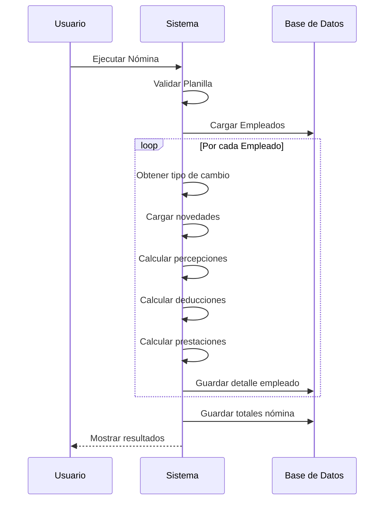
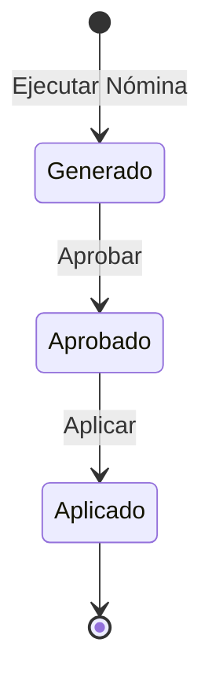

# Ejecución de Nómina

Esta guía explica cómo ejecutar una nómina completa en Coati Payroll.

## Requisitos Previos

Antes de ejecutar una nómina, asegúrese de tener:

- [x] Planilla configurada y activa
- [x] Empleados asignados a la planilla
- [x] Percepciones asignadas (si aplica)
- [x] Deducciones asignadas con prioridades
- [x] Prestaciones asignadas
- [x] Tipos de cambio actualizados (si hay multi-moneda)

## Acceder a la Ejecución

1. Navegue a **Planillas**
2. Haga clic en la planilla deseada
3. Haga clic en **Ejecutar Nómina**

## Configurar el Período

### Campos del Período

| Campo | Descripción | Ejemplo |
|-------|-------------|---------|
| Período Inicio | Primer día del período | 01/01/2025 |
| Período Fin | Último día del período | 31/01/2025 |
| Fecha de Cálculo | Fecha para cálculos (tipo cambio, vigencia) | 31/01/2025 |

### Sugerencia Automática

El sistema sugiere fechas basándose en:

- La última nómina ejecutada (si existe)
- El tipo de periodicidad de la planilla

```
Si última nómina: 01/12/2024 - 31/12/2024
Entonces sugiere: 01/01/2025 - 31/01/2025
```

## Ejecutar la Nómina

1. Verifique las fechas del período
2. Haga clic en **Ejecutar Nómina**
3. Espere a que el sistema procese

### Proceso de Ejecución



## Resultado de la Ejecución

### Mensajes de Éxito

Si todo es correcto, verá:

- ✅ "Nómina generada exitosamente"
- Redirección al detalle de la nómina

### Errores

Si hay errores, verá mensajes como:

- ❌ "La planilla no está activa"
- ❌ "La planilla no tiene empleados asignados"
- ❌ "Error procesando empleado X"

### Advertencias

Las advertencias no detienen la ejecución pero indican situaciones especiales:

- ⚠️ "Empleado X no está activo y será omitido"
- ⚠️ "No se encontró tipo de cambio para empleado X. Usando 1.00"
- ⚠️ "Deducción X omitida por saldo insuficiente"
- ⚠️ "Salario neto negativo. Ajustando a 0.00"

## Ver Detalle de la Nómina

Después de ejecutar, puede ver:

### Resumen General

| Campo | Descripción |
|-------|-------------|
| Planilla | Nombre de la planilla |
| Período | Fechas de inicio y fin |
| Estado | Generado, Aprobado, Aplicado |
| Total Bruto | Suma de salarios brutos |
| Total Deducciones | Suma de deducciones |
| Total Neto | Suma de salarios netos |

### Lista de Empleados

| Empleado | Bruto | Deducciones | Neto |
|----------|-------|-------------|------|
| Juan Pérez | C$ 20,000 | C$ 3,200 | C$ 16,800 |
| María López | C$ 25,000 | C$ 4,500 | C$ 20,500 |
| **Total** | **C$ 45,000** | **C$ 7,700** | **C$ 37,300** |

### Detalle por Empleado

Al hacer clic en un empleado, verá:

#### Percepciones

| Código | Descripción | Monto |
|--------|-------------|-------|
| SALARIO_BASE | Salario Base | C$ 20,000.00 |
| HRS_EXTRA | Horas Extras | C$ 1,500.00 |
| **Total Ingresos** | | **C$ 21,500.00** |

#### Deducciones

| Código | Descripción | Monto |
|--------|-------------|-------|
| INSS_LABORAL | INSS Laboral 7% | C$ 1,505.00 |
| IR | Impuesto sobre la Renta | C$ 850.00 |
| PRESTAMO_001 | Cuota préstamo | C$ 2,000.00 |
| **Total Deducciones** | | **C$ 4,355.00** |

#### Prestaciones (Costos Patronales)

| Código | Descripción | Monto |
|--------|-------------|-------|
| INSS_PATRONAL | INSS Patronal 22.5% | C$ 4,837.50 |
| INATEC | INATEC 2% | C$ 430.00 |
| VACACIONES | Provisión Vacaciones | C$ 1,791.05 |
| AGUINALDO | Provisión Aguinaldo | C$ 1,791.05 |
| INDEMNIZACION | Provisión Indemnización | C$ 1,791.05 |
| **Total Prestaciones** | | **C$ 10,640.65** |

#### Resumen

```
Salario Bruto:           C$ 21,500.00
(-) Total Deducciones:   C$  4,355.00
(=) Salario Neto:        C$ 17,145.00

Costo Total Empleado:
  Salario Bruto:         C$ 21,500.00
  (+) Prestaciones:      C$ 10,640.65
  (=) Costo Total:       C$ 32,140.65
```

## Estados de la Nómina

### Flujo de Estados



### Descripción de Estados

| Estado | Descripción | Acciones Posibles |
|--------|-------------|-------------------|
| **Generado** | Nómina calculada, pendiente de revisión | Revisar, Aprobar |
| **Aprobado** | Nómina revisada, autorizada para pago | Aplicar |
| **Aplicado** | Nómina pagada | Solo consulta |

### Aprobar Nómina

1. Revise el detalle de la nómina
2. Verifique los cálculos
3. Haga clic en **Aprobar**

!!! warning "Revisar Antes de Aprobar"
    Una vez aprobada, no es posible modificar la nómina. Revise cuidadosamente todos los detalles.

### Aplicar Nómina

1. La nómina debe estar aprobada
2. Haga clic en **Aplicar**
3. La nómina queda marcada como pagada

## Historial de Nóminas

Para ver nóminas anteriores:

1. Navegue a la planilla
2. Haga clic en **Ver Nóminas**
3. Verá el listado de todas las nóminas ejecutadas

| Período | Fecha Generación | Estado | Total Neto |
|---------|------------------|--------|------------|
| Enero 2025 | 31/01/2025 | Aplicado | C$ 37,300 |
| Diciembre 2024 | 31/12/2024 | Aplicado | C$ 35,800 |

## Novedades de Nómina

Las novedades son eventos que afectan la nómina de un empleado específico.

### Tipos de Novedades

| Tipo | Ejemplo | Efecto |
|------|---------|--------|
| Horas | Horas extras trabajadas | Multiplica por valor hora |
| Días | Días de ausencia | Reduce proporcionalmente |
| Cantidad | Unidades producidas | Para bonos por producción |
| Monto | Comisión específica | Suma el monto |

### Registrar Novedad

1. Antes de ejecutar la nómina
2. Registre las novedades por empleado
3. Al ejecutar, las novedades se aplicarán automáticamente

## Cálculos Importantes

### Salario Bruto

```
Salario Bruto = Salario Base + ∑ Percepciones
```

### Salario Neto

```
Salario Neto = Salario Bruto - ∑ Deducciones
```

### Base Gravable (para IR)

```
Base Gravable = Salario Bruto - Deducciones Antes de Impuesto
```

### Costo Total Empleado

```
Costo Total = Salario Bruto + ∑ Prestaciones
```

## Ejemplo Completo

### Empleado: María López

**Datos:**
- Salario Base: C$ 25,000.00
- Horas Extras: 10 horas
- Valor Hora Extra: C$ 156.25 (salario/30/8 × 1.5)

**Cálculo:**

```
PERCEPCIONES:
  Salario Base:                   C$ 25,000.00
  Horas Extras (10 × 156.25):     C$  1,562.50
  -------------------------------------------
  SALARIO BRUTO:                  C$ 26,562.50

DEDUCCIONES (en orden de prioridad):
  INSS Laboral (7% de 26,562.50): C$  1,859.38
  Base para IR: 26,562.50 - 1,859.38 = 24,703.12
  IR (según tabla):               C$    950.00
  Cuota Préstamo:                 C$  2,000.00
  Ahorro Voluntario:              C$    500.00
  -------------------------------------------
  TOTAL DEDUCCIONES:              C$  5,309.38

SALARIO NETO: 26,562.50 - 5,309.38 = C$ 21,253.12

PRESTACIONES PATRONALES:
  INSS Patronal (22.5%):          C$  5,976.56
  INATEC (2%):                    C$    531.25
  Vacaciones (8.33%):             C$  2,212.56
  Aguinaldo (8.33%):              C$  2,212.56
  Indemnización (8.33%):          C$  2,212.56
  -------------------------------------------
  TOTAL PRESTACIONES:             C$ 13,145.49

COSTO TOTAL EMPLEADO: 26,562.50 + 13,145.49 = C$ 39,707.99
```

## Buenas Prácticas

### Antes de Ejecutar

- Verifique tipos de cambio actualizados
- Registre todas las novedades
- Revise préstamos y adelantos pendientes
- Verifique empleados activos

### Durante la Revisión

- Revise las advertencias generadas
- Verifique empleados con salario neto muy bajo
- Compare con nóminas anteriores
- Valide cálculos de empleados clave

### Después de Aplicar

- Genere reportes de pago
- Actualice la contabilidad
- Archive la documentación

## Solución de Problemas

### "La nómina no procesa ningún empleado"

- Verifique empleados asignados y activos
- Verifique fechas de asignación a la planilla

### "Cálculo de IR incorrecto"

- Verifique deducciones antes de impuesto
- Verifique valores acumulados del empleado
- Revise la regla de cálculo de IR

### "Préstamo no se dedujo"

- Verifique estado del préstamo (debe ser "Aprobado")
- Verifique saldo pendiente
- Revise la prioridad (puede haberse omitido)
