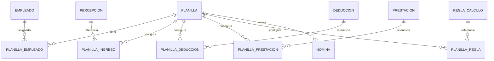
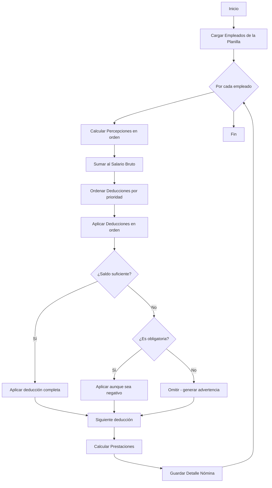

# Configuración de Planillas

La planilla es el elemento central que conecta todos los componentes del sistema para ejecutar la nómina.

## Concepto

Una planilla define:

- Qué empleados se procesan
- Qué percepciones se aplican
- Qué deducciones se descuentan (y en qué orden)
- Qué prestaciones se calculan
- Qué reglas de cálculo se usan
- En qué moneda se paga
- Con qué periodicidad se ejecuta

## Acceder al Módulo

1. Navegue a **Planillas**

## Crear Nueva Planilla

1. Haga clic en **Nueva Planilla**
2. Complete el formulario de datos básicos
3. Guarde para acceder a la configuración completa

### Datos Básicos

| Campo | Descripción | Requerido |
|-------|-------------|-----------|
| Nombre | Nombre único de la planilla | Sí |
| Descripción | Descripción opcional | No |
| Tipo de Planilla | Mensual, quincenal, semanal | Sí |
| Moneda | Moneda de pago | Sí |
| Activo | Si la planilla está activa | Sí |

### Tipo de Planilla: periodicidad y año fiscal

El **Tipo de Planilla** define la periodicidad de pago y el inicio del año fiscal. Estas opciones afectan los prorrateos y los acumulados:

#### Periodicidad

| Opción | Efecto en el cálculo |
|--------|----------------------|
| **Mensual** | Si el período cubre el mes completo, paga salario completo. Si no, prorratea por días. |
| **Quincenal** | Si el período tiene los días configurados, paga salario/quincena. Si no, prorratea por días. |
| **Semanal** | Siempre prorratea por días. |

#### Mes de inicio fiscal

El **Mes Inicio Fiscal** determina desde qué mes se acumulan los valores anuales y cómo se calcula el período fiscal del empleado.

Ejemplo: Si el año fiscal inicia en abril, el sistema considera abril como mes 1 del período fiscal al calcular acumulados y meses restantes.

!!! important "Coherencia en implementaciones a mitad de año"
   Si migra en medio del año fiscal, alinee la planilla y los empleados así:

   - Configure correctamente el **Mes Inicio Fiscal** en la planilla.
   - Registre en el empleado el **Último mes cerrado** y los saldos acumulados previos.
   - Verifique que el **Año de implementación inicial** del empleado corresponda al período fiscal que inicia en la planilla.

   Con esta coherencia, el cálculo de IR inicial considera meses y saldos históricos correctamente desde la primera nómina en el sistema.

### Período Fiscal

| Campo | Descripción |
|-------|-------------|
| Inicio Período Fiscal | Fecha de inicio del año fiscal |
| Fin Período Fiscal | Fecha de fin del año fiscal |

### Deducciones Automáticas

| Campo | Descripción | Default |
|-------|-------------|---------|
| Aplicar Préstamos Automáticamente | Deducir cuotas de préstamos | Sí |
| Aplicar Adelantos Automáticamente | Deducir adelantos | Sí |
| Prioridad Préstamos | Orden de prioridad (menor = primero) | 250 |
| Prioridad Adelantos | Orden de prioridad | 251 |

## Editar Planilla

Después de crear la planilla, puede configurar todos los componentes:

1. Navegue a **Planillas**
2. Haga clic en la planilla a editar
3. Verá el formulario de edición con secciones para:
   - Datos básicos
   - Empleados asignados
   - Percepciones asignadas
   - Deducciones asignadas
   - Prestaciones asignadas
   - Reglas de cálculo

## Asignar Empleados

Los empleados asignados serán procesados cuando se ejecute la nómina.

### Agregar Empleado

1. En la sección **Empleados**, haga clic en **Agregar**
2. Seleccione el empleado de la lista
3. Configure:
   - **Fecha de inicio**: Desde cuándo el empleado está en esta planilla
   - **Activo**: Si el empleado está activo en esta planilla
4. Haga clic en **Agregar**

### Remover Empleado

1. En la lista de empleados asignados
2. Haga clic en **Remover** junto al empleado

!!! info "Empleados en Múltiples Planillas"
    Un empleado puede estar en múltiples planillas si recibe pagos en diferentes periodicidades o monedas.

## Asignar Percepciones

Las percepciones definen los ingresos adicionales que se aplicarán a los empleados.

### Agregar Percepción

1. En la sección **Percepciones**, haga clic en **Agregar**
2. Seleccione la percepción
3. Configure:
   - **Orden**: Secuencia de cálculo
   - **Monto Predeterminado**: Override del monto (opcional)
   - **Porcentaje**: Override del porcentaje (opcional)
4. Haga clic en **Agregar**

### Orden de Percepciones

El orden determina la secuencia de cálculo. Es importante cuando una percepción depende de otra:

```
Orden 1: Salario Base
Orden 2: Horas Extras (% del salario)
Orden 3: Comisión (% del bruto incluyendo HE)
```

## Asignar Deducciones

Las deducciones se aplican en **orden de prioridad**. Esta es una configuración crítica.

### Agregar Deducción

1. En la sección **Deducciones**, haga clic en **Agregar**
2. Seleccione la deducción
3. Configure:
   - **Prioridad**: Orden de aplicación (menor = primero)
   - **Es Obligatoria**: ¿Se aplica aunque no haya saldo?
   - **Monto Predeterminado**: Override del monto (opcional)
4. Haga clic en **Agregar**

### Configurar Prioridades

!!! important "Concepto Crítico"
    Las deducciones se aplican en orden de prioridad. Si el salario no alcanza, las de baja prioridad se omiten.

#### Guía de Prioridades Recomendadas

| Prioridad | Tipo | Ejemplos |
|-----------|------|----------|
| 1-50 | Seguridad Social | INSS Laboral |
| 51-100 | Impuestos | IR |
| 101-150 | Pensiones | Pensión alimenticia |
| 151-200 | Embargos | Embargos judiciales |
| 201-250 | Préstamos empresa | Cuotas de préstamos |
| 251-300 | Adelantos | Adelantos salariales |
| 301-350 | Voluntarias | Ahorro, sindicato |
| 351-400 | Otras | Otras deducciones |

### Actualizar Prioridad

1. En la lista de deducciones asignadas
2. Haga clic en **Editar** o use el campo de prioridad
3. Modifique el valor
4. Guarde

### Deducción Obligatoria

Si marca una deducción como **obligatoria**:

- Se aplica aunque el salario neto quede en negativo
- Útil para deducciones legales que no pueden omitirse
- Genera advertencia si no hay saldo suficiente

## Asignar Prestaciones

Las prestaciones son aportes patronales que se calculan pero no afectan el salario del empleado.

### Agregar Prestación

1. En la sección **Prestaciones**, haga clic en **Agregar**
2. Seleccione la prestación
3. Configure:
   - **Orden**: Secuencia de cálculo
4. Haga clic en **Agregar**

## Reglas de Cálculo

Las reglas de cálculo definen lógica compleja como el cálculo del IR.

### Agregar Regla de Cálculo

1. En la sección **Reglas de Cálculo**, haga clic en **Agregar**
2. Seleccione la regla
3. Configure:
   - **Orden**: Secuencia de ejecución
4. Haga clic en **Agregar**

!!! note "Reglas de IR"
    El cálculo del IR en Nicaragua requiere una regla especial que considere:
    
    - Salario acumulado del año
    - IR retenido acumulado
    - Tabla de tramos progresivos
    - Proyección anual

## Ejemplo de Configuración Completa

### Planilla Mensual NIO

```yaml
Nombre: Planilla Mensual Córdobas
Tipo: Mensual (30 días)
Moneda: NIO
Período Fiscal: 01/01/2025 - 31/12/2025

Empleados:
  - Juan Pérez (desde 01/01/2020)
  - María López (desde 15/06/2022)
  - Carlos Ruiz (desde 01/03/2024)

Percepciones:
  1. Salario Base (orden: 1)
  2. Horas Extras (orden: 2)
  3. Bonificaciones (orden: 3)

Deducciones (por prioridad):
  1. INSS Laboral 7% (prioridad: 10, obligatoria)
  2. IR (prioridad: 50, obligatoria)
  3. Cuota Sindical (prioridad: 300)
  4. Ahorro Voluntario (prioridad: 350)

Prestaciones:
  1. INSS Patronal 22.5%
  2. INATEC 2%
  3. Vacaciones 8.33%
  4. Aguinaldo 8.33%
  5. Indemnización 8.33%

Reglas de Cálculo:
  1. IR Nicaragua v1.0.0
```

## Diagrama de Relaciones



## Flujo de Procesamiento

Cuando se ejecuta la nómina, el sistema procesa en este orden:



## Buenas Prácticas

### Organización

- Use nombres descriptivos para las planillas
- Agrupe empleados por tipo de pago o área
- Documente las configuraciones especiales

### Prioridades

- Configure prioridades correctamente
- Las deducciones legales siempre primero
- Documente el orden de prioridades

### Pruebas

- Ejecute nóminas de prueba antes de producción
- Verifique los cálculos con casos conocidos
- Revise las advertencias generadas

## Solución de Problemas

### "No hay empleados para procesar"

- Verifique que hay empleados asignados
- Verifique que los empleados están activos
- Verifique las fechas de asignación

### "Deducción no aplicada"

- Revise la prioridad
- Puede haberse omitido por saldo insuficiente
- Verifique las advertencias de la nómina

### "Monto incorrecto"

- Verifique si hay overrides configurados
- Revise la configuración de la percepción/deducción
- Verifique el tipo de cálculo
