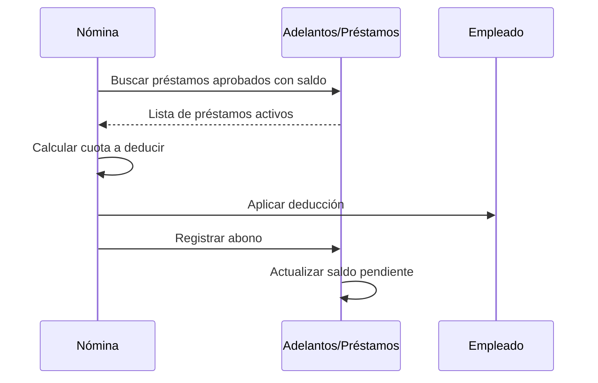

# Préstamos y Adelantos

El sistema permite gestionar préstamos a empleados y adelantos salariales con deducción automática en la nómina.

## Conceptos

### Préstamo

Un préstamo es un monto otorgado al empleado que se recupera en cuotas fijas durante un período determinado.

**Características:**

- Monto aprobado definido
- Número de cuotas pactadas
- Cuota fija mensual
- Se asocia a una deducción específica

### Adelanto Salarial

Un adelanto es una porción del salario pagada antes de la fecha normal de pago.

**Características:**

- Se descuenta en la siguiente nómina
- Puede ser el monto completo o en cuotas
- No necesita asociarse a una deducción

## Acceder al Módulo

El módulo de adelantos está disponible en la gestión de empleados o como módulo independiente.

## Registrar un Préstamo

### Paso 1: Crear la Solicitud

1. Navegue al módulo de **Adelantos/Préstamos**
2. Haga clic en **Nuevo**
3. Complete el formulario:

| Campo | Descripción |
|-------|-------------|
| Empleado | Seleccione el empleado |
| Fecha de solicitud | Fecha en que se solicita |
| Monto solicitado | Cantidad solicitada |
| Cuotas pactadas | Número de cuotas para pagar |
| Motivo | Razón del préstamo |
| Deducción | Deducción asociada (para préstamos) |

### Paso 2: Aprobar el Préstamo

1. Revise la solicitud
2. Ajuste el **Monto aprobado** si es necesario
3. Configure el **Monto por cuota**
4. Cambie el estado a **Aprobado**
5. Guarde los cambios

### Campos de Aprobación

| Campo | Descripción |
|-------|-------------|
| Monto aprobado | Cantidad aprobada (puede ser menor al solicitado) |
| Fecha de aprobación | Fecha de aprobación |
| Monto por cuota | Cuota mensual a deducir |
| Aprobado por | Usuario que aprueba |

## Registrar un Adelanto Salarial

Los adelantos salariales siguen el mismo proceso pero:

- No requieren deducción asociada
- Generalmente se pagan en una sola cuota
- Se descuentan en la siguiente nómina

### Ejemplo

```yaml
Tipo: Adelanto Salarial
Empleado: Juan Pérez
Monto solicitado: 5,000.00
Cuotas pactadas: 1  # Se descuenta todo en la siguiente nómina
Deducción: (vacío)  # No asociado a deducción
```

## Estados del Préstamo/Adelanto

| Estado | Descripción |
|--------|-------------|
| **Pendiente** | Solicitud registrada, pendiente de aprobación |
| **Aprobado** | Aprobado, se deducirá en nómina |
| **Pagado** | Completamente pagado |
| **Rechazado** | Solicitud rechazada |

## Deducción Automática

!!! info "Funcionamiento"
    El sistema deduce automáticamente los préstamos y adelantos aprobados durante la ejecución de la nómina.

### Configuración en la Planilla

En cada planilla puede configurar:

| Campo | Descripción | Valor por defecto |
|-------|-------------|-------------------|
| Aplicar Préstamos Automáticamente | ¿Deducir cuotas de préstamos? | Sí |
| Aplicar Adelantos Automáticamente | ¿Deducir adelantos? | Sí |
| Prioridad Préstamos | Orden de prioridad para préstamos | 250 |
| Prioridad Adelantos | Orden de prioridad para adelantos | 251 |

### Flujo de Deducción



### Registro de Abonos

Cada deducción aplicada genera un registro de abono:

| Campo | Descripción |
|-------|-------------|
| Fecha de abono | Fecha de la nómina |
| Monto abonado | Cuota deducida |
| Saldo anterior | Saldo antes del abono |
| Saldo posterior | Saldo después del abono |
| Tipo de abono | "nomina" |
| Nómina | Referencia a la nómina |

## Prioridad de Deducciones

Los préstamos y adelantos tienen prioridades configurables:

```
1-100:   Deducciones legales (INSS, IR)
101-200: Pensiones alimenticias, embargos
201-300: ← Préstamos (default: 250)
         ← Adelantos (default: 251)
301-400: Deducciones voluntarias
```

Si el salario no alcanza para todas las deducciones, las de menor prioridad se omiten.

## Ejemplo Completo

### Escenario

- **Empleado**: María López
- **Salario bruto**: C$ 20,000.00
- **Préstamo pendiente**: C$ 10,000.00 (cuota: C$ 2,000.00)
- **Adelanto pendiente**: C$ 3,000.00

### Proceso en Nómina

```
Salario Bruto:           C$ 20,000.00
- INSS Laboral (7%):     C$  1,400.00
- IR:                    C$    500.00
- Préstamo (cuota):      C$  2,000.00  ← Automático
- Adelanto:              C$  3,000.00  ← Automático
= Salario Neto:          C$ 13,100.00
```

### Actualización de Saldos

```
Préstamo:
  Saldo anterior: C$ 10,000.00
  Cuota aplicada: C$  2,000.00
  Saldo nuevo:    C$  8,000.00

Adelanto:
  Saldo anterior: C$ 3,000.00
  Cuota aplicada: C$ 3,000.00
  Saldo nuevo:    C$ 0.00 → Estado: Pagado
```

## Consultar Historial

Para ver el historial de pagos de un préstamo:

1. Acceda al detalle del préstamo/adelanto
2. Consulte la sección de **Abonos**
3. Cada abono muestra:
   - Fecha
   - Monto
   - Nómina relacionada
   - Saldo antes/después

## Pago Anticipado

Si un empleado desea pagar anticipadamente:

1. Edite el préstamo/adelanto
2. Registre un abono manual (tipo: "manual")
3. Actualice el saldo pendiente
4. Si el saldo llega a cero, cambie el estado a "Pagado"

## Casos Especiales

### Salario Insuficiente

Si el salario no alcanza para la cuota completa:

- Se deduce solo lo disponible
- El sistema registra un abono parcial
- El saldo pendiente se ajusta
- Se genera una advertencia en la nómina

### Empleado Inactivo

Si un empleado es dado de baja con préstamo pendiente:

- El préstamo permanece registrado
- Debe gestionarse el cobro manualmente
- Considere incluir el saldo en la liquidación

### Múltiples Préstamos

Un empleado puede tener múltiples préstamos activos:

- Cada uno tiene su propia cuota
- Se deducen en el orden de creación
- Si no alcanza el salario, se aplican en orden

## Buenas Prácticas

### Política de Préstamos

- Defina montos máximos según el salario
- Establezca número máximo de cuotas
- Requiera aprobación para montos grandes

### Control

- Revise préstamos antes de aprobar
- Verifique la capacidad de pago del empleado
- Documente el motivo de cada préstamo

### Seguimiento

- Revise periódicamente los saldos pendientes
- Gestione préstamos de empleados que dejan la empresa
- Mantenga actualizado el estado de cada préstamo

## Reportes

El sistema permite generar reportes de:

- Préstamos activos por empleado
- Saldos pendientes totales
- Historial de abonos
- Deudores con salario insuficiente

## Solución de Problemas

### "El préstamo no se dedujo"

- Verifique que el estado sea "Aprobado"
- Verifique que tenga saldo pendiente > 0
- Verifique que la planilla tenga activada la deducción automática
- Verifique la prioridad (puede haberse omitido por saldo insuficiente)

### "Se dedujo menos de la cuota"

- El salario disponible no alcanzó para la cuota completa
- Revise las advertencias de la nómina
- Verifique las deducciones de mayor prioridad
