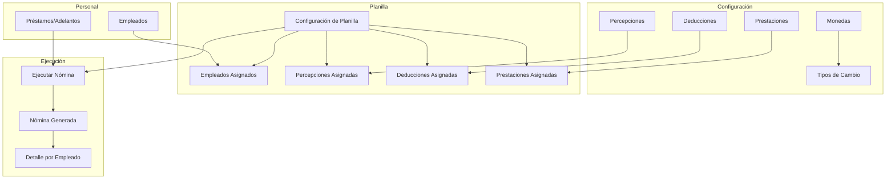
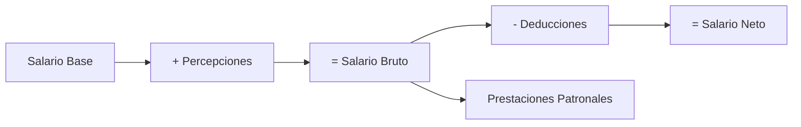

# Primeros Pasos

Esta guía le ayudará a familiarizarse con Coati Payroll y preparar el sistema para su primer uso.

## Acceso al Sistema

### Iniciar Sesión

1. Abra su navegador web
2. Navegue a la URL del sistema (por defecto: `http://localhost:5000`)
3. Ingrese sus credenciales:
   - **Usuario**: Su nombre de usuario o correo electrónico
   - **Contraseña**: Su contraseña

### Pantalla Principal

Después de iniciar sesión, verá el panel principal con acceso a todos los módulos del sistema:

- **Personal**: Gestión de empleados
- **Configuración**: Empresas, monedas, tipos de cambio, percepciones, deducciones y prestaciones
- **Planillas**: Configuración y ejecución de nóminas

## Estructura del Sistema

Coati Payroll está organizado en módulos que trabajan juntos para calcular la nómina:

## Flujo de Trabajo Típico

### 1. Configuración Inicial (Una sola vez)

Antes de usar el sistema, configure los catálogos base:

1. **Crear empresas** - Las entidades o razones sociales que gestionará el sistema (opcional, para multi-empresa)
2. **Crear monedas** - Las monedas en las que pagará salarios
3. **Crear percepciones** - Los conceptos de ingresos (bonos, comisiones, etc.)
4. **Crear deducciones** - Los conceptos de descuentos (INSS, IR, etc.)
5. **Crear prestaciones** - Los aportes patronales (INSS patronal, vacaciones, etc.)

### 2. Gestión de Personal (Continuo)

- Registrar nuevos empleados
- Actualizar información de empleados existentes
- Gestionar préstamos y adelantos

### 3. Configuración de Planilla (Una vez por planilla)

- Crear la planilla
- Asignar empleados
- Asignar percepciones, deducciones y prestaciones
- Configurar prioridades de deducciones

### 4. Ejecución de Nómina (Periódico)

- Seleccionar período de nómina
- Ejecutar el cálculo
- Revisar y aprobar
- Aplicar nómina (marcar como pagada)

## Conceptos Clave

### Percepciones

Son los **ingresos** del empleado adicionales al salario base. Se **suman** al salario bruto.

**Ejemplos:**

- Horas extras
- Bonos de productividad
- Comisiones
- Viáticos

### Deducciones

Son los **descuentos** del salario del empleado. Se **restan** del salario bruto.

**Ejemplos:**

- INSS laboral
- Impuesto sobre la renta (IR)
- Cuotas de préstamos
- Cuota sindical

!!! info "Orden de Prioridad"
    Las deducciones se aplican en orden de prioridad. Si el salario no alcanza para todas las deducciones, se aplican primero las de mayor prioridad (número menor).

### Prestaciones

Son **aportes del empleador** que NO afectan el salario neto del empleado. Son costos adicionales de la empresa.

**Ejemplos:**

- INSS patronal
- INATEC
- Provisión de vacaciones
- Provisión de aguinaldo
- Provisión de indemnización

### Planilla

Es la configuración maestra que conecta:

- Tipo de periodicidad (mensual, quincenal, semanal)
- Moneda de pago
- Empleados asignados
- Percepciones aplicables
- Deducciones aplicables (con prioridades)
- Prestaciones aplicables

### Nómina

Es la **ejecución** de una planilla para un período específico. Contiene:

- Fecha de inicio y fin del período
- Total bruto
- Total deducciones
- Total neto
- Detalle por cada empleado

## Cálculo de la Nómina

El motor de nómina sigue este flujo para cada empleado:

1. **Salario Base**: El salario definido en el registro del empleado
2. **+ Percepciones**: Se suman todos los ingresos adicionales
3. **= Salario Bruto**: Total antes de deducciones
4. **- Deducciones**: Se restan en orden de prioridad
5. **= Salario Neto**: Lo que recibe el empleado
6. **Prestaciones**: Se calculan los aportes patronales (no afectan salario neto)

## Siguiente Paso

Continúe con la configuración de cada módulo:

1. [Gestión de Usuarios](usuarios.md)
2. [Gestión de Empresas](empresas.md) *(opcional, para multi-empresa)*
3. [Monedas y Tipos de Cambio](monedas.md)
4. [Gestión de Empleados](empleados.md)
5. [Percepciones](percepciones.md)
6. [Deducciones](deducciones.md)
7. [Prestaciones](prestaciones.md)
8. [Préstamos y Adelantos](prestamos.md)
9. [Configuración de Planillas](planillas.md)
10. [Ejecución de Nómina](nomina.md)

!!! tip "Tutorial Completo"
    Para un ejemplo práctico paso a paso, consulte el [Tutorial: Nómina Completa](../tutorial/nomina-completa.md).
