# Coati Payroll

Bienvenido a la documentación oficial de **Coati Payroll**, un sistema de administración de nóminas y planillas desarrollado por BMO Soluciones, S.A.

## 쯈ué es Coati Payroll?

Coati Payroll es una aplicación web diseñada para facilitar la gestión completa del proceso de nómina de una o múltiples empresas. El sistema permite:

- **Multi-empresa**: Gestione nóminas para múltiples empresas o entidades desde una sola instalación.
- **Gestión de Empleados**: Registro y administración completa de la información del personal.
- **Campos Personalizados**: Extienda la información de empleados con campos personalizados definidos por el usuario.
- **Configuración de Conceptos de Nómina**: Percepciones (ingresos), deducciones y prestaciones patronales.
- **Reglas de Cálculo**: Motor de reglas con esquemas configurables para cálculos complejos como impuestos y seguridad social.
- **Planillas Flexibles**: Configuración de diferentes tipos de planilla (mensual, quincenal, semanal).
- **Cálculo Automático**: Motor de cálculo que procesa automáticamente salarios, deducciones e impuestos.
- **Procesamiento en Segundo Plano**: Sistema de colas para nóminas grandes con feedback en tiempo real.
- **Préstamos y Adelantos**: Control de préstamos a empleados con deducción automática de cuotas.
- **Multi-moneda**: Soporte para múltiples monedas con tipos de cambio configurables.

## Características Principales

### 📋 Gestión de Planillas

Las planillas son el elemento central del sistema. Una planilla conecta:

- Empleados asignados
- Percepciones (ingresos adicionales al salario)
- Deducciones (descuentos del salario)
- Prestaciones (aportes patronales)
- Reglas de cálculo (impuestos, seguridad social)

### 💰 Cálculo de Nómina

El motor de nómina procesa automáticamente:

1. **Percepciones**: Se suman al salario base (bonos, comisiones, horas extras)
2. **Deducciones**: Se restan del salario bruto en orden de prioridad
3. **Prestaciones**: Costos patronales que no afectan el salario neto del empleado

### 🔄 Deducción Automática de Préstamos

El sistema deduce automáticamente:

- Cuotas de préstamos aprobados
- Adelantos salariales pendientes

La prioridad de estas deducciones es configurable por planilla.

## Comenzando

-   :material-download:{ .lg .middle } __Instalación__

    ---

    Aprende a instalar y configurar Coati Payroll en tu servidor.

    [:octicons-arrow-right-24: Guía de Instalación](instalacion/instalacion.md)

-   :material-rocket-launch:{ .lg .middle } __Primeros Pasos__

    ---

    Configura tu primera planilla y ejecuta tu primera nómina.

    [:octicons-arrow-right-24: Primeros Pasos](guia/primeros-pasos.md)

-   :material-school:{ .lg .middle } __Tutorial Completo__

    ---

    Sigue el tutorial paso a paso para configurar una nómina completa.

    [:octicons-arrow-right-24: Tutorial](tutorial/nomina-completa.md)

-   :material-help-circle:{ .lg .middle } __Preguntas Frecuentes__

    ---

    Encuentra respuestas a las preguntas más comunes.

    [:octicons-arrow-right-24: FAQ](referencia/faq.md)

## Estructura del Sistema

El siguiente diagrama muestra cómo se relacionan los componentes principales del sistema:

### Flujo de Trabajo de Nómina

```mermaid
graph LR
    A[Ejecutar Nómina] --> B[Agregar Novedades]
    B --> C[Recalcular si es necesario]
    C --> D[Revisar y Aprobar]
    D --> E[Aplicar/Pagar]
```

## Características Avanzadas

### Sistema de Colas

Para nóminas grandes (más de 100 empleados por defecto), el sistema utiliza procesamiento en segundo plano:

- **Procesamiento paralelo**: Los empleados se procesan de forma concurrente
- **Feedback en tiempo real**: Progreso visible durante el cálculo
- **Doble backend**: Dramatiq+Redis (producción) o Huey+Filesystem (desarrollo)
- **Selección automática**: El sistema elige el mejor backend disponible

[:octicons-arrow-right-24: Más sobre el Sistema de Colas](queue_system.md)

### Campos Personalizados

Extienda la información de empleados con campos adicionales:

- Información médica (tipo de sangre, alergias)
- Contactos de emergencia
- Información bancaria adicional
- Cualquier dato específico de su organización

[:octicons-arrow-right-24: Guía de Campos Personalizados](guia/campos-personalizados.md)

### Reglas de Cálculo

Configure cálculos complejos usando esquemas estructurados:

- Impuestos progresivos (IR)
- Seguridad social con topes (INSS)
- Bonos escalonados
- Cualquier cálculo basado en tramos o tablas

[:octicons-arrow-right-24: Guía de Reglas de Cálculo](guia/reglas-calculo.md)

## Licencia

Coati Payroll está licenciado bajo la [Licencia Apache 2.0](https://www.apache.org/licenses/LICENSE-2.0).

## Soporte

Para reportar problemas o solicitar nuevas funcionalidades, por favor visite el [repositorio en GitHub](https://github.com/williamjmorenor/coati).
