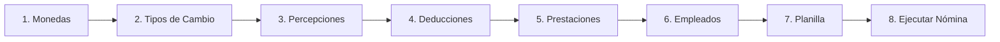

# Configuración Inicial

Después de instalar Coati Payroll, siga estos pasos para configurar el sistema antes de comenzar a usarlo.

## Primer Inicio de Sesión

1. Abra su navegador y acceda a la URL de la aplicación (por defecto: `http://localhost:5000`)
2. Inicie sesión con las credenciales de administrador:
   - **Usuario**: `coati-admin` (o el valor de `ADMIN_USER`)
   - **Contraseña**: `coati-admin` (o el valor de `ADMIN_PASSWORD`)

!!! warning "Seguridad"
    Cambie la contraseña del administrador inmediatamente después del primer inicio de sesión.

## Orden de Configuración Recomendado

Para configurar el sistema correctamente, siga este orden:

## Paso 1: Configurar Monedas

Las monedas son necesarias para definir los salarios de los empleados y las planillas.

1. Navegue a **Catálogos > Monedas**
2. Haga clic en **Nueva Moneda**
3. Complete los campos:
   - **Código**: Código ISO de la moneda (ej: `NIO`, `USD`)
   - **Nombre**: Nombre completo (ej: `Córdoba Nicaragüense`)
   - **Símbolo**: Símbolo de la moneda (ej: `C$`, `$`)
4. Guarde la moneda

!!! example "Ejemplo - Córdoba Nicaragüense"
    - Código: `NIO`
    - Nombre: `Córdoba Nicaragüense`
    - Símbolo: `C$`

## Paso 2: Configurar Tipos de Cambio (Opcional)

Si su empresa opera con múltiples monedas, configure los tipos de cambio:

1. Navegue a **Catálogos > Tipos de Cambio**
2. Haga clic en **Nuevo Tipo de Cambio**
3. Configure:
   - **Fecha**: Fecha de vigencia del tipo de cambio
   - **Moneda Origen**: Moneda a convertir
   - **Moneda Destino**: Moneda de destino
   - **Tasa**: Valor del tipo de cambio

## Paso 3: Crear Percepciones

Las percepciones son los ingresos adicionales al salario base.

1. Navegue a **Conceptos > Percepciones**
2. Haga clic en **Nueva Percepción**
3. Configure según el tipo de ingreso

**Percepciones comunes:**

| Código | Nombre | Tipo de Cálculo | Descripción |
|--------|--------|-----------------|-------------|
| `HRS_EXTRA` | Horas Extras | Fórmula | Pago por horas trabajadas adicionales |
| `BONO_PROD` | Bono Productividad | Monto Fijo | Bonificación por cumplimiento de metas |
| `COMISION` | Comisiones | Porcentaje | Comisión sobre ventas |
| `VIATICOS` | Viáticos | Monto Fijo | Gastos de transporte y alimentación |

## Paso 4: Crear Deducciones

Las deducciones son los descuentos del salario del empleado.

1. Navegue a **Conceptos > Deducciones**
2. Haga clic en **Nueva Deducción**
3. Configure según el tipo de descuento

**Deducciones comunes:**

| Código | Nombre | Tipo | Es Impuesto |
|--------|--------|------|-------------|
| `INSS_LABORAL` | INSS Laboral | Seguro Social | No |
| `IR` | Impuesto sobre la Renta | Impuesto | Sí |
| `SINDICATO` | Cuota Sindical | Sindical | No |
| `AHORRO` | Ahorro Voluntario | Ahorro | No |

!!! info "INSS Laboral Nicaragua"
    El INSS laboral en Nicaragua es del 7% del salario bruto.
    Configure: Tipo de Cálculo = `Porcentaje del Salario Bruto`, Porcentaje = `7.00`

## Paso 5: Crear Prestaciones

Las prestaciones son aportes patronales que NO afectan el salario del empleado.

1. Navegue a **Conceptos > Prestaciones**
2. Haga clic en **Nueva Prestación**
3. Configure según el aporte patronal

**Prestaciones comunes (Nicaragua):**

| Código | Nombre | Porcentaje | Descripción |
|--------|--------|------------|-------------|
| `INSS_PATRONAL` | INSS Patronal | 22.50% | Aporte patronal al INSS |
| `INATEC` | INATEC | 2.00% | Aporte para capacitación |
| `VACACIONES` | Provisión Vacaciones | 8.33% | Provisión mensual (1/12) |
| `AGUINALDO` | Provisión Aguinaldo | 8.33% | Provisión treceavo mes (1/12) |
| `INDEMNIZACION` | Provisión Indemnización | 8.33% | Provisión por antigüedad (1/12) |

## Paso 6: Registrar Empleados

Antes de crear la planilla, registre los empleados:

1. Navegue a **Personal > Empleados**
2. Haga clic en **Nuevo Empleado**
3. Complete la información obligatoria:
   - Nombres y apellidos
   - Identificación personal
   - Fecha de alta
   - Salario base
   - Moneda del salario

## Paso 7: Crear Tipo de Planilla

El tipo de planilla define la periodicidad y configuración fiscal:

1. Navegue a **Planillas > Tipos de Planilla** (si está disponible)
2. O use los tipos predeterminados:
   - Mensual (30 días)
   - Quincenal (15 días)
   - Semanal (7 días)

## Paso 8: Crear la Planilla

La planilla conecta todos los componentes:

1. Navegue a **Planillas > Nueva Planilla**
2. Configure los datos básicos:
   - Nombre de la planilla
   - Tipo de planilla
   - Moneda
3. Agregue los componentes:
   - Asigne empleados
   - Asigne percepciones
   - Asigne deducciones (con prioridades)
   - Asigne prestaciones

## Siguiente Paso

Una vez completada la configuración inicial, puede:

- [Ejecutar su primera nómina](../guia/nomina.md)
- [Revisar el tutorial completo](../tutorial/nomina-completa.md)

!!! tip "Tutorial Paso a Paso"
    Si prefiere un ejemplo práctico detallado, consulte el [Tutorial: Nómina Completa](../tutorial/nomina-completa.md).
